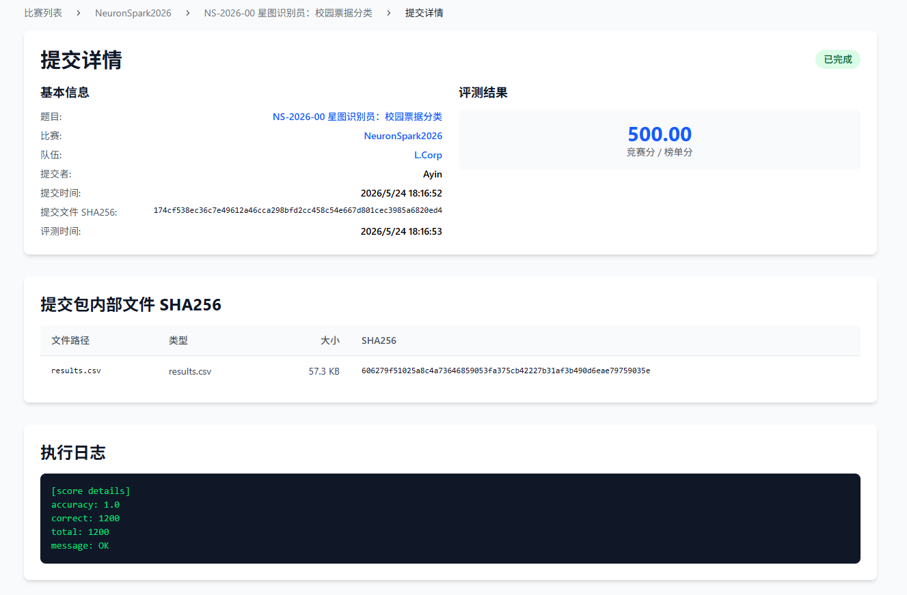
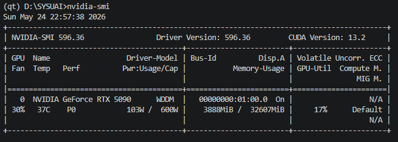
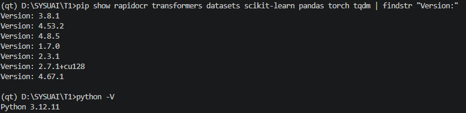
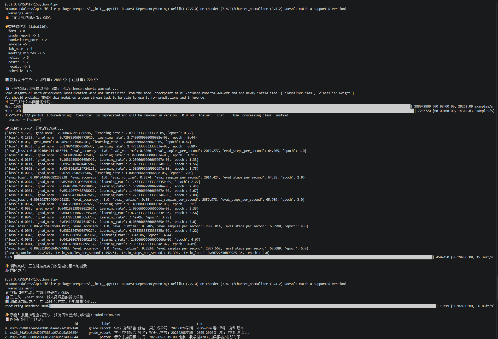
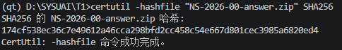
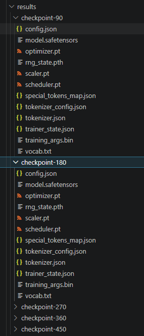

# NS-2026-00 星图识别员：校园票据分类 — Writeup

## 1. 基本信息
- **队长用户名**：Ayin
- **队伍名**：L.Corp
- **题号**：NS-2026-00
- **最终官网提交记录**：
  - 提交时间：2026-05-24 18:16:52
  - 最终有效得分：500 分

  
---


## 2. 解题概述

本题任务是对 10 类校园文档图片（发票、小票、课程表、海报等）进行自动分类，选择以 **OCR 文本提取 + 预训练中文文本分类模型** 为核心方案。

具体流程为：使用 RapidOCR 对训练集和测试集图片进行批量 OCR 识别，将提取到的文本保存为 CSV；随后以 `hfl/chinese-roberta-wwm-ext` 作为骨干网络进行序列分类微调，最终对测试集完成推理并生成提交文件。

本地验证集准确率为 **1.0（100%）**，线上提交准确率同为 **1.0（1200/1200）**，获满分 500 分。

---

## 3. 关键改进与实验依据

1. **将 PaddleOCR 替换为 RapidOCR**
   PaddleOCR 在本机环境下依赖安装复杂、推理速度较慢。更换为 RapidOCR 后，环境配置更简洁，批量处理速度明显提升，OCR 阶段整体耗时大幅缩短。由于最终准确率均为满分，此改动的主要价值体现在工程效率上，未做精度消融。

2. **使用中文预训练模型 `hfl/chinese-roberta-wwm-ext`**
   相比通用多语言模型，该模型针对中文语料以全词掩码策略预训练，对中文文档文本的理解更准确。配合 OCR 提取的中文票据文本，分类效果直接达到满分，无需额外调参。

---

## 4. 验证与复现

### 运行环境

| 项目 | 信息 |
|------|------|
| 操作系统 | Windows 11 |
| Python 版本 | 3.12.11 |
| PyTorch 版本 | 2.7.1+cu128 |
| Transformers 版本 | 4.53.2 |
| RapidOCR 版本 | 3.8.1 |
| datasets 版本 | 4.8.5 |
| scikit-learn 版本 | 1.7.0 |
| CPU 型号 | AMD Ryzen 7 9800X3D 8-Core Processor |
| GPU 型号 | NVIDIA RTX 5090 |
| 内存 (RAM) | 48 GB |
| CUDA 版本 | 13.2 |

### 随机种子与核心超参数

- **随机种子**：训练/验证集切分固定 `random_state=42`。
- **最大序列长度**：`max_length=256`
- **学习率**：`3e-5`
- **训练 Batch Size**：`32`
- **训练 Epoch**：`5`
- **优化器权重衰减**：`0.01`

### 预计运行时间与主要资源消耗

- **OCR 提取阶段**：预计耗时约 5-10 分钟，主要消耗 CPU 资源。
- **模型微调阶段**：预计耗时约 1-2 分钟，GPU 显存占用约 6GB。
- **模型推理阶段**：预计耗时约 5-10 秒。

### 数据预处理
使用了rapidocr对图片提取文本，具体代码见OCR.py，提前将训练集和测试集的文本提取出来

### 复现步骤

```bash
# 1. 安装依赖
pip install rapidocr transformers datasets scikit-learn pandas torch tqdm

# 2. OCR 提取：对训练集和测试集图片提取文本，生成 train_text.csv 和 test_text.csv
python OCR.py

# 3. 训练分类模型：读取 train_text.csv，微调 chinese-roberta-wwm-ext，保存至 ./best_model
python train.py

# 4. 推理并生成提交文件：读取 test_text.csv，输出 results.csv
python inference.py
```


### OCR 失败样例说明

以下为使用 RapidOCR 处理时遇到的典型失败情形：

1. **横线上填写文字是会识别出额外的下划线**：id:ns26_cc4821a760c7f393dac5938f1ae11779, OCR 结果中下划线被误识别为文本的一部分，导致提取文本包含下划线字符。
2. **日期和时间空格较小，识别连在一起**：id:ns26_bf5921de2c27b0d98bdd2f1631736505, OCR 结果中日期和时间被识别为一个连续字符串，缺乏空格分隔，不便于解析。
3. **有部分文字超出图片边界**：id:ns26_0e6d38a3150a64906e30549c4b5497a3, OCR 结果中部分文字未被识别，因为它们位于图片边缘，导致提取文本不完整。

> 上述情况比较少见，即使 OCR 结果不完整，模型仍能通过残留关键词正确分类。

---

## 5.AI使用声明
### 全局说明
- 本队使用的AI工具：Gemini,Claude
- 主要用途：资料查询/代码辅助
### 逐题声明
#### NS-2026-00
- 官方等级：A1
- 实际使用：资料查询 / 代码辅助
- AI是否接触完整题面：否
- AI是否接触测试输入：否
- AI是否接触提交反馈或排行榜反馈：否
- AI是否生成或修改最终提交：否
- 是否使用商业API、闭源远程模型或托管式Agent：是 
- 详细说明：使用了Gemini和Claude两个闭源远程模型，主要用于资料查询和代码辅助
## Writeup 写作辅助声明
- 是否使用 AI 辅助撰写或润色：是
- 使用工具：Gemini
- 使用范围：语言润色 / Markdown 排版 / 根据本队实验记录整理段落
- AI 接触材料：代码片段 / Writeup要求
- AI 是否生成新的实验结果、验证分数或复现命令：否
- 人工核对方式：队伍成员核对事实、代码、日志、分数和复现命令

---
## 6. 最终提交与 SHA256
- 平台提交文件名称：NS-2026-00-answer.zip
- 平台提交时间：2026-05-24 18:16:52
- 最终有效得分：500
- 答案 ZIP SHA256（提交文件 SHA256）：174cf538ec36c7e49612a46cca298bfd2cc458c54e667d801cec3985a6820ed4
- 内部关键文件 SHA256（提交包内部 SHA256）：
  - results.csv ：606279f51025a8c4a73646859053fa375cb42227b31af3b490d6eae79759035e


## 7. 证据截图
















---

## 7. 代码包

代码包包含以下文件：

```
Ayin-NS-00/
├── README.md            # 本文件，含复现步骤
├── evidence/            # 证据截图目录
├── submission/          # 最终提交副本
└── src/                 # 复现源码目录 相对路径需调整，因为模型文件放在了外面一层目录
    ├── OCR.py           # 步骤一：批量 OCR 文本提取
    ├── train.py         # 步骤二：微调文本分类模型
    └── inference.py     # 步骤三：批量推理，生成 results.csv
```

