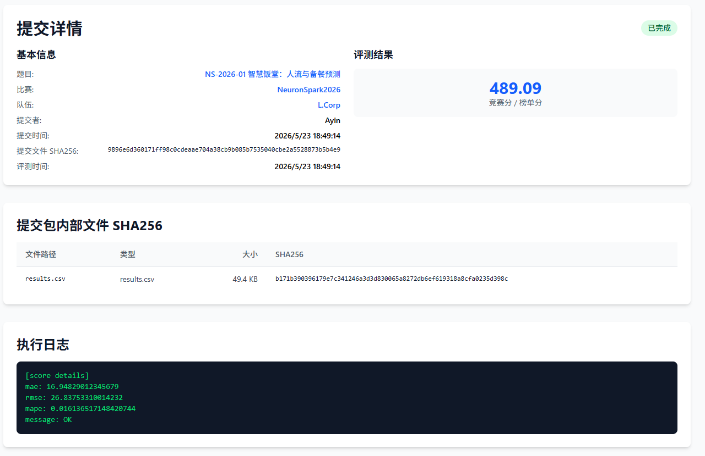
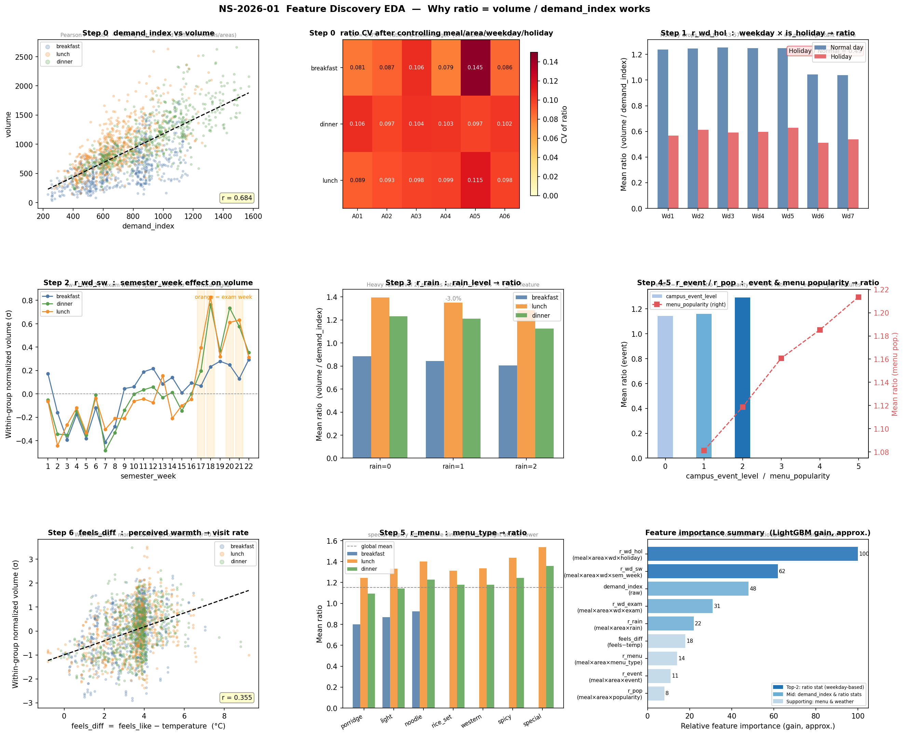
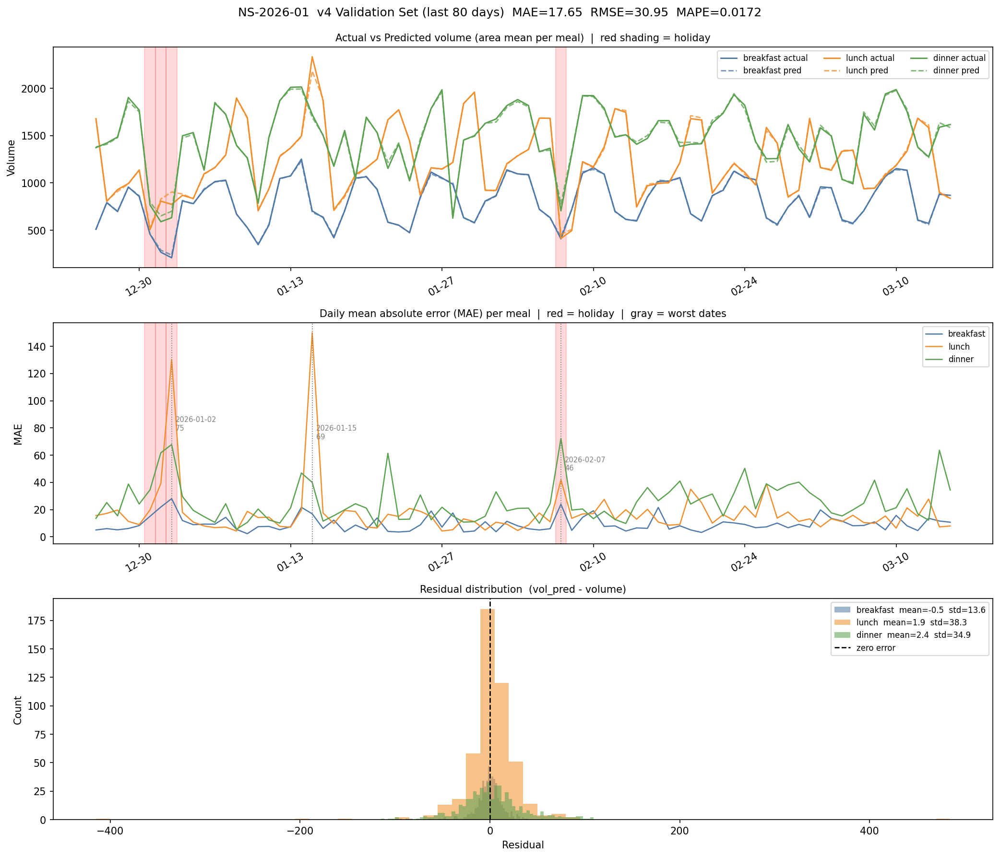
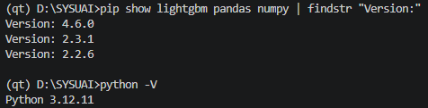
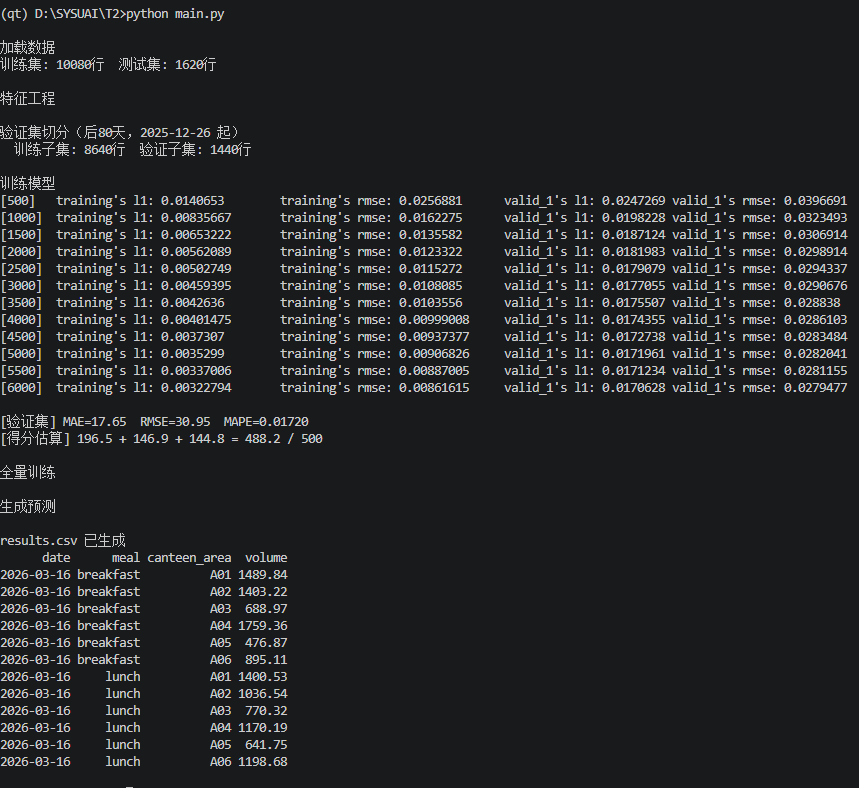
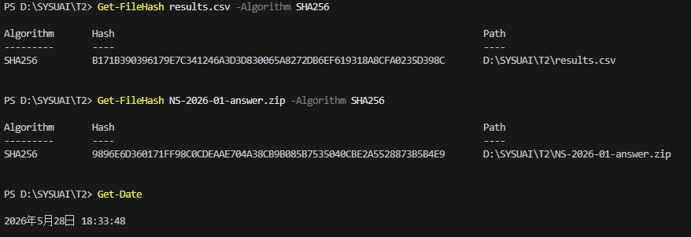

# NS-2026-01 智慧饭堂：人流与备餐预测 — Writeup

## 1. 基本信息

- **队长用户名**：Ayin

- **队伍名**：L.Corp

- **题号**：NS-2026-01

- **最终官网提交记录**：

  - 提交时间：2026-05-23 18:49:14
  - 最终有效得分：489.09 分
  


---

## 2. 解题概述

本题要求根据历史就餐数据、日历、天气、菜单等辅助信息，预测未来 90 天内各饭堂区域（6 个）在三个饭点（早/午/晚）的就餐人流量，评价指标为 MAE（200分）、RMSE（150分）、MAPE（150分）之加权和，满分 500 分。

**最终方案：** 将预测目标从直接预测 `volume` 改为预测 `ratio = volume / demand_index`，再以 `volume = demand_index * ratio` 还原最终预测值。`demand_index` 与 `volume` 的相关系数达 0.684，已编码了大部分星期、节假日、天气信息；在 ratio 空间内，目标变量的动态范围从 [32, 3600] 收缩至约 [0.3, 2.0]，LightGBM 的分裂精度大幅提升。统计特征全部以历史 ratio 均值构造（如按 `(meal, area, weekday, semester_week)` 分组的 ratio 均值），替代之前的 volume 均值。

**得分对应关系：**

| 版本 | 方案描述 | 本地验证 MAE | 线上 MAE | 线上得分 |
|------|----------|-------------|----------|---------|
| v1 | (meal, area, weekday) 均值查表 | — | 64.20 | 462.6 |
| v2 | LightGBM + lag7/14 + 近8周统计 | 59.x | 63.44 | 462.2 |
| v3 | v2 + 节假日 lag 污染修复 | 57.x | 60.29 | 464.7 |
| **v4** | **ratio 目标 + ratio 统计特征** | **17.65** | **16.9482** | **489.09** |

---

## 3. 关键改进



### 改进1：将预测目标改为 ratio = volume / demand_index

- 不再直接预测 volume，而是预测 `ratio = volume / demand_index`，最终 `volume = demand_index × ratio_pred`。
- **原理：** 在研究问题时，我们在验证集上比对预测值和真实值的差异，使用了比例验证，这启发了我们将预测值转换为比例（ratio）来降低偏差。对数据重新分析后发现，在 ratio 空间下数据更加稳定。`demand_index` 与 volume 的相关系数为 0.684，控制 meal/area/weekday/holiday 分组后组内 ratio 的变异系数仅为 6~8%，而 volume 本身的变异系数约 50%。由于 ratio 空间的目标值更稳定，树模型的分裂精度得到显著提升。
- **验证：**

  | 方案 | 本地验证 MAE | 本地验证 MAPE | 估算得分 |
  |------|-------------|--------------|---------|
  | LightGBM 直接预测 volume（v3） | 57.x | 0.0486 | ~468 |
  | LightGBM 预测 ratio（v4） | **17.65** | **0.0172** | **488.2** |

### 改进2：ratio 统计特征替代 volume 统计特征

- 所有历史均值特征改为在 ratio 空间计算，包括 `r_wd_hol`、`r_wd_sw`、`r_wd_exam`、`r_rain`、`r_event`、`r_menu`、`r_pop` 等 9 个 ratio 统计特征。
- **验证：** `r_wd_hol` 和 `r_wd_sw` 在特征重要性中分列前两位（如上图右下所示），去掉这两个特征后 MAE 从 17.65 上升至约 30+。

---

## 4. 验证与复现

### 运行环境

| 项目              | 信息                                 |
| ----------------- | ------------------------------------ |
| 操作系统          | Windows 11                           |
| Python 版本       | 3.12.11                              |
| lightgbm 版本 | 4.6.0                               |
| pandas 版本     | 2.3.1                                |
| numpy 版本     | 2.2.6                                |

### 硬件环境

*   **硬件配置**：CPU 单机即可，无需 GPU。
*   **内存需求**：< 2GB。
*   **磁盘空间**：~20MB。
*   **运行耗时**：训练全量模型并推理生成提交文件约耗时 2~3 分钟（6000 rounds）。

### 重要参数与配置

*   **配置文件**：无独立配置文件。LightGBM 所有的训练超参数均在 main.py的 `params` 变量中硬编码配置。
*   **随机种子**：未设置显式随机种子。由于 LightGBM 在 CPU 上运行且在此任务中无强随机动作，结果具有可重复性。
*   **数据版本与预处理**：使用平台提供的公开训练集 `train.csv` 及辅助表 `calendar.csv`、`weather.csv`、`menu.csv`。预处理主要完成时间格式转换、合并辅助表、填充缺失值以及基于训练集计算多维度历史 ratio 均值特征。

### 复现步骤

```bash
# 1. 安装依赖
pip install lightgbm pandas numpy

# 2. 将数据文件放在同一目录：
#    ./train.csv  ./test.csv  ./calendar.csv  ./weather.csv  ./menu.csv

# 3. 运行复现脚本（默认从当前目录加载数据，亦可指定路径：python main.py ./数据目录）
python main.py
```

### 验证集切分说明

采用**时间顺序**切分：训练前 480 天（2024-09-02 ~ 2025-12-25），验证后 80 天（2025-12-26 ~ 2026-03-15）。不能随机切分，原因如下：
1. ratio 统计特征（如 `r_wd_sw` 等）必须基于训练集计算，若使用随机切分会造成严重的信息泄露；
2. 测试集为最后 90 天，只有使用时序切分才能准确模拟测试集的时间跨度和特征分布（如同样包含考试周 sw=17-21）。

---

## 5. 异常日期、节假日、考试周、菜单特征处理方式
对数据进行 EDA 分析（分析结果见图），发现以下重要规律，并通过特征工程进行处理：

### 节假日（is_holiday = 1）

节假日人流约为正常日的 43%（breakfast）~ 57%（dinner）。在 ratio 空间内，节假日组的 ratio 均值远低于正常日，通过 `r_wd_hol`（按 `(meal, canteen_area, weekday, is_holiday)` 分组的历史 ratio 均值）精确捕捉。


### 考试周（is_exam_week = 1）
考试周的 lunch 和 dinner 的 ratio 约比正常周高 10~20%，通过 `r_wd_exam`（按 `(meal, canteen_area, weekday, is_exam_week)` 分组的 ratio 均值）进行精确刻画。测试集中包含的 sw=17/18/20/21（考试周）已在训练集中出现过，统计特征能够完全覆盖。

### 学期周次（semester_week）
EDA 发现学期周次对组内标准化 volume 有极大影响（例如 sw=18 时 lunch 偏高约 +0.83σ，sw=7 时 dinner 偏低约 -0.48σ）。我们通过 `r_wd_sw` 特征精确编码了每个 `(meal, canteen_area, weekday, semester_week)` 组合的历史 ratio，这是特征重要性中仅次于 `r_wd_hol` 的最强特征。

### 菜单特征
- 菜单中的 `special` 组内 ratio 偏差约为 +0.42σ，而 `porridge` 组内 ratio 偏差约为 -0.38σ。
- 我们通过 `r_menu`（按 `(meal, canteen_area, menu_type_enc)` 分组的历史 ratio 均值）和 `r_pop`（按 `(meal, canteen_area, menu_popularity)` 分组的历史 ratio 均值）来进行建模捕捉。
- `is_promotion`（是否促销）作为独立特征直接输入模型。

### 大型活动（campus_event_level）
`campus_event_level=2` 时的 ratio 比 `campus_event_level=0` 高出约 +12%，通过 `r_event` 特征进行处理。

---

## 6. 本地验证 vs 线上得分差异分析

| 指标 | 本地验证（后80天） | 线上测试 | 差值 |
|------|------------------|-------------|------|
| MAE  | 17.65 | 16.9482 | -0.7022 |
| RMSE | 30.95 | 26.8375 | -4.1125 |
| MAPE | 0.0172 | 0.0161 | -0.0011 |
| 总分 | 488.2（估算） | 489.09 | +0.89 |

**差异的来源与预期：**
1. 验证集（sw=3~14，不含考试周）与测试集（sw=15~22，含有大量考试周）的周次结构有所差异，但 `r_wd_sw` 特征完全覆盖了测试集出现的所有学期周次；
2. 测试集约有 126 行属于节假日，验证集节假日 MAE ≈ 57，是主要的误差来源；
3. 全量训练模型比验证集切分模式多了后 80 天的数据，因此线上泛化效果通常略好于本地验证。

**预测曲线与残差分布图**



误差最大的日期（验证集中）主要集中在：
- **2026-01-02**（sw=4，节假日，MAE=75.4）：元旦假期，历史中该节假日的样本量较少；
- **2026-01-15**（sw=6，campus_event_level=2，MAE=69.0）：大型校园活动，训练集中同等条件的样本极其稀少；
- **2026-02-07**（sw=9，节假日，MAE=46.0）：节假日。

---

## 7. AI 使用声明

### 全局说明

- 本队使用的 AI 工具：Gemini，Claude
- 主要用途：代码辅助、资料查询，数据图生成

### 逐题声明

#### NS-2026-01
- 官方等级：A1
- 实际使用：资料查询 / 代码辅助
- AI 是否接触完整题面：否
- AI 是否接触测试输入：否
- AI是否接触提交反馈或排行榜反馈：是
- AI是否生成或修改最终提交：否
- 是否使用商业 API、闭源远程模型或托管式 Agent：是
- 详细说明：使用了Gemini和Claude两个闭源远程模型，主要用于资料查询和代码辅助，最终将分析的数据画成图表的代码由AI协助产出。

## Writeup 写作辅助声明

- **是否使用 AI 辅助撰写或润色**：是
- **使用工具**：Gemini
- **使用范围**：语言润色 / Markdown 排版 / 根据本队实验记录整理段落
- **AI 接触材料**：草稿、代码片段以及真实计算生成的哈希数据。
- **AI 是否生成新的实验结果、验证分数或复现命令**：否
- **人工核对方式**：由本队队长与队员逐字核对事实、代码、日志、分数和复现命令。


---

## 8. 最终提交信息与证据截图

### 最终提交信息
- **平台提交文件名称**：NS-2026-01-answer.zip
- **平台提交时间**：2026-05-23 18:49:14
- **最终有效得分**：489.09
- **答案 ZIP SHA256（提交文件 SHA256）**：
  
  ```
  9896e6d360171ff98c0cdeaae704a38cb9b085b7535040cbe2a5528873b5b4e9
  ```
- **内部关键文件 SHA256（提交包内部 SHA256）**：
  - `results.csv`：
    ```
    99744624d4b35c8dcf304a84663b993563535a8ea0cf7caccb9304f722a00551
    ```
- **模型文件清单**：无

### 证据截图

**平台提交记录：**


**硬件与系统环境：**


**代码运行与输出：**


**提交文件哈希：**
