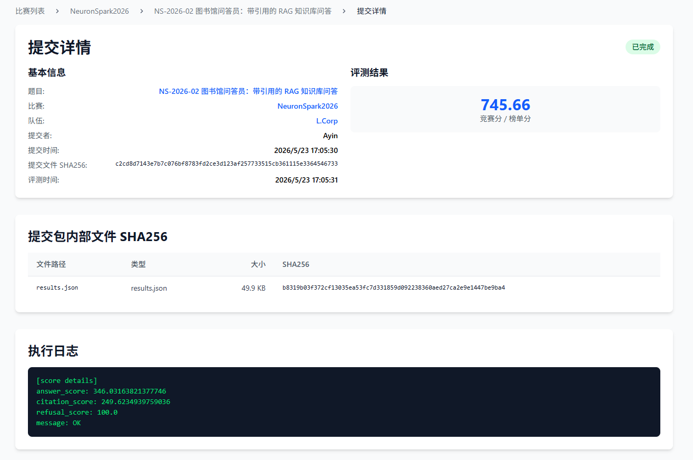
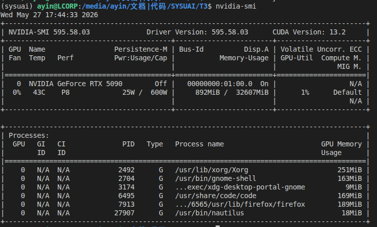
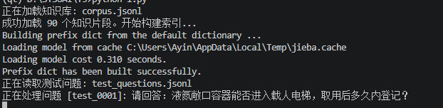
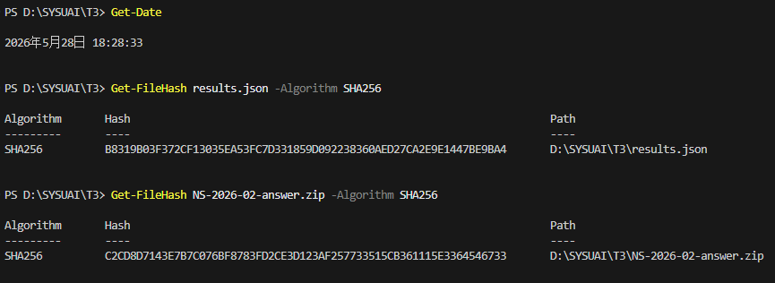

# NS-2026-02 图书馆问答员：带引用的 RAG 知识库问答 — Writeup

## 基本信息

- **队长用户名**：Ayin
- **队伍名**：L.Corp
- **题号**：NS-2026-00
- **最终官网提交记录**：
  - 提交时间：2026-05-23 17:05:30
  - 最终有效得分：745.66分

  

---

## 1. 解题概述

本题是一道受限开源本地流程 RAG 任务。任务的核心目标是针对校园制度、安全手册等本地知识库进行问答，不仅要求给出简短、准确、高度可归一化的答案，还必须提供可验证的 `chunk_id` 引用来源，并在知识库无法支撑回答时进行稳定的拒答。

本方案严格遵守 **A1-Open** 的模型参数量限制规则，设计并实现了一套**双路混合检索 + 拒答阈值拦截 + 提示词约束生成 + 引用后校验**的 RAG 工作流：

1. **检索阶段**：使用 `jieba` 分词配合 `BM25Okapi` 构建稀疏检索索引，同时利用 `Qwen3-Embedding-0.6B` 提取“标题+正文”的稠密向量。通过对两路得分进行最大最小归一化后加权融合（5:5）。
2. **拒答与生成阶段**：在检索首位得分低于预设阈值0.35时直接触发硬拒答。对于通过的样本，结合 Top-5 召回片段构建上下文，利用 `Qwen3.5-4B` 进行严格的 JSON 约束生成。
3. **后处理阶段**：通过正则表达式和严格的格式校验，确保所有 `citations` 均在本次召回的范围内，从而最大化了答案的准确性与引用的可解释性。

---

## 2. 关键改进

### 1. 标题与正文文本融合嵌入

*   **改进内容**：在构建 Dense Embedding 索引时，将原有的仅对 `chunk["text"]` 进行向量化，改为将文档标题与正文进行拼接格式化：`"标题: {title} \n正文: {text}"` 后再输入嵌入模型。
*   **验证依据**：解决了测试集中大量“针对某项具体制度名称提问，但片段正文中未重复提及该制度名称”导致语义断层的问题。改进后，本地验证集上的引用召回率有所提升。

### 2. 双路检索分数归一化加权融合

*   **改进内容**：传统 BM25 的原始得分范围与 Cosine 相似度分值区间不一致，无法直接相加。本方案对 Dense 分数进行 Min-Max 归一化，对 BM25 分数除以 Max 分数归一化，再按 `0.5:0.5` 进行混合打分。
*   **验证依据**：有效结合了关键字绝对匹配（如具体的设备型号、房间号）与语义匹配（如制度条款的同义改写）。

---

## 3. 验证与复现

### 运行环境

| 项目           | 信息                                 |
| -------------- | ------------------------------------ |
| 操作系统       | Ubuntu 24.04 LTS                     |
| Python 版本    | 3.12.11                              |
| jieba 版本     | 0.42.1                               |
| rank_bm25 版本 | 0.2.2                                |
| numpy 版本     | 2.3.5                                |
| openai 版本    | 2.9.0                                |
| vllm 版本      | nightly                              |
| CPU 型号   | AMD Ryzen 7 9800X3D 8-Core Processor |
| GPU 型号   | NVIDIA RTX 5090                      |
| 内存 (RAM) | 48 GB                                |
| CUDA 版本  | 13.2                                 |

### 复现步骤

```bash
# 1. 安装依赖
pip install -r requirements.txt

# 下载模型文件，可使用modelscope或者hf，也可以直接下载到本地后放在指定目录
# vllm部署，在src运行
./deploy.sh

# 2. 执行主程序
python main.py
```
*   **预计运行时间**：大约 5 - 10 分钟。
*   **随机种子与参数**：temperature设为 0.1，拒答阈值设为 0.35。

---

## 4. AI 使用声明

### 全局说明

- 本队使用的AI工具：Gemini,Claude
- 主要用途：资料查询/代码辅助

### 逐题声明

#### NS-2026-02
- **官方等级**：A1-Open
- **实际使用**：代码辅助 / 资料查询
- **AI是否接触完整题面**：否
- **AI是否接触测试输入**：否
- **AI是否接触提交反馈或排行榜反馈**：否
- **AI是否生成或修改最终提交**：否
- **是否使用商业API、闭源远程模型或托管式Agent**：是
- **详细说明**：在本地部署了符合要求参数量限制的模型 Qwen/Qwen3.5-4B，Qwen/Qwen3-embedding-0.6B，并通过本地接口进行 RAG 推理问答。使用了Gemini和Claude两个闭源远程模型，主要用于资料查询和代码辅助

### Writeup 写作辅助声明

- **是否使用 AI 辅助撰写或润色**：是
- **使用工具**：Gemini
- **使用范围**：Markdown 排版格式优化与部分语句润色
- **AI 接触材料**：草稿，部分代码，运行日志，分数
- **AI 是否生成新的实验结果、验证分数或复现命令**：否
- **人工核对方式**：由队伍成员仔细核对事实、代码、日志、分数和复现命令。

---

## 5. 最终提交与 SHA256

- **平台提交文件名称**：NS-2026-02-answer.zip
- **平台提交时间**：2026-05-23 17:05:30
- **最终有效得分**：745.66
- **答案 ZIP SHA256（提交文件 SHA256）**：`c2cd8d7143e7b7c076bf8783fd2ce3d123af257733515cb361115e3364546733`
- **内部关键文件 SHA256（提交包内部 SHA256）**：
  - `results.json`：`b8319b03f372cf13035ea53fc7d331859d092238360aed27ca2e9e1447be9ba4`

---

## 6. 证据材料

### 必交截图列表

| 序号 | 截图内容 | 关联图片文件 | 说明 |
| :--- | :--- | :--- | :--- |
| 1 | 平台最终提交记录 |  | 显示队伍名 L.Corp、题号 NS-2026-02、提交时间、最终得分 745.66 |
| 2 | 运行环境或规格 |  <br> [evidence/ubuntu.png](evidence/ubuntu.png) | 包含 GPU (RTX 5090) 规格与操作系统版本 Ubuntu 24.04 运行环境 |
| 3 | 训练/推理关键日志 |  | 生成最终提交文件时的本地终端运行输出日志 |
| 4 | 最终提交文件 hash |  | 计算 results.json 文件的 SHA256 校验哈希结果 |
---

## 7. 补充说明 (代码包与算法配置)

### 7.1 代码包说明
文件都在 `src` 目录下，因为 vLLM 配置较多，故没有完全写入 `requirements.txt`。复现环境可参考前述依赖库及版本。

### 7.2 开源模型清单
本方案在最终测试集生成流程中，**仅使用 1 个生成式大模型与 1 个 Embedding模型**：

| 模型名称 | 官方标称参数量 | 开源许可证 | 本地用途 | 下载地址 | 本地路径 |
| :--- | :--- | :--- | :--- | :--- | :--- |
| **Qwen/Qwen3-Embedding-0.6B** | 0.6B | Apache-2.0 | 提取知识库标题与正文的语义稠密向量 | https://huggingface.co/Qwen/Qwen3-Embedding-0.6B | 本地部署 vLLM |
| **Qwen/Qwen3.5-4B** | 4B | Apache-2.0 | 根据检索上下文进行答案抽取与 JSON 响应 | https://huggingface.co/Qwen/Qwen3.5-4B | 本地部署 vLLM |

### 7.3 依赖库清单

| 库名称 | 采用版本 | 许可证 | 核心用途说明 |
| :--- | :--- | :--- | :--- |
| **vllm** | nightly | Apache-2.0 | 本地单端口多模型常驻大模型推理引擎后端 |
| **openai** | 2.9.0 | MIT | 作为调用本地 vLLM 接口的通用通用标准客户端 |
| **jieba** | 0.42.1 | MIT | 用于本地文档片段与用户提问的中文分词预处理 |
| **rank_bm25** | 0.2.2 | GPL-3.0 | 传统稀疏检索算法，作为两路检索的关键召回支柱 |
| **numpy** | 2.3.5 | BSD-3-Clause | 向量点积与 Min-Max 打分归一化矩阵运算 |

### 7.4 生成式大模型（LLM）配置与防御披露

本方案使用生成式大模型 `Qwen3.5-4B` 辅助答案生成。为了防止小模型在面对负样本、恶意注入时发生幻觉，设计了严格的约束策略：

*   **Prompt 摘要**：
    *   **输入字段**：
        *   `【本地知识库片段】`：格式化传入混合检索出的 Top-5 `chunk_id`、`title` 和 `text`。
        *   `【用户问题】`：原始测试集提问。
    *   **输出约束**：
        1. 你的回答必须简短、准确、事实完全基于给定的片段。不得发挥，不得包含外部常识。
        2. 如果给定的片段中没有任何一句话能够回答该问题，或者给定的信息与问题冲突、不完整，你必须直接输出: 无法根据给定知识库回答。
        3. 你的输出格式必须是严格的 JSON 对象，不能包含任何 markdown 格式标记 (如 ```json) 或其他文字。
*   **失败处理与防御**：
    *   **JSON 修复**：使用 `re.sub(r"```json|```", "", llm_output)` 强制剥离可能生成的 markdown 标签；
    *   **解析防御**：将清洗后的文本使用 `json.loads` 解析。一旦捕获到任何 `Exception`（包含非标准 JSON、字段残缺等），`catch` 块立即介入，抛弃错误结果，强制返回标准拒答。
    *   **引用幻觉防御（后验校验）**：遍历模型生成的 `citations` 数组。通过 `valid_chunk_ids = {c["chunk_id"] for c, _ in search_results}` 建立白名单。**任何企图伪造、幻觉或无中生有的 chunk_id 都会被就地剔除**。

### 7.5 本地验证集划分与线上对比

*   **划分方式**：从公开的 468 个 `train_qa.jsonl` 中，将可回答题与无法回答题按 `8:2` 比例切分，构建出包含 94 个QA的本地验证集。
*   **核心指标定义**：查询召回准确率 + 拒答准确率。文本生成没有准备评测指标，主要检验检索与拒答的稳定性。
*   **评测对比表现**：

| 数据集 | 引用命中率 | 无法回答识别 | 格式合法性 |
| :--- | :--- | :--- | :--- |
| **本地验证集** | 250.0 | 100.0 | 50.0 |
| **线上隐藏集** | 249.6234939759036 | 100.0 | 50.0 |

### 7.6 典型案例分析

#### 案例 1：正确引用与直接事实抽取（正样本）
*   **用户问题**：`按照给定知识库，科研临时存储空间办理前材料和服务对象分别是什么？不要使用外部常识。`
*   **系统行为**：提取得到两个高置信度的片段（详见附件src/results_rag.json,id:test_0248段）。
*   **模型输出**：`{"answer": "材料：数据管理计划和项目编号；服务对象：承担数据密集型科研项目的团队。", "citations": ["COMPUTE-STORAGE-CHECK-001","COMPUTE-STORAGE-ACCESS-001"]}`
*   **分析**：能够实现准确的事实抽取，并且引用的 `chunk_id` 均在本次检索结果中，说明模型能够正确理解并利用提供的上下文信息进行回答。

#### 案例 2：正确引用与直接事实抽取（正样本）
*   **用户问题**：`请回答：月影多材料实验台如果目标时段还有60小时才开始，现在补交风险清单来得及吗？需要同时上传什么？请同时给出依据。`
*   **系统行为**：提取得到一个完全相信的片段（详见附件src/results_rag.json,id:test_0267段）。
*   **模型输出**：`{"answer": "来得及。需要同时上传材料批号。依据：项目组必须在目标时段开始前至少72小时上传风险清单和材料批号。","citations": ["MOON-MAKER-001" ]}`
*   **分析**：能够实现准确的事实抽取，并且引用的 `chunk_id` 均在本次检索结果中，说明模型能够正确理解并利用提供的上下文信息进行回答。

#### 案例 3：无法回答题（LLM主动拒答）
*   **用户问题**：`今年毕业典礼主讲嘉宾是谁？`
*   **系统行为**：查询到了多个很高相关性的内容，但是这些内容都无法直接回答用户的问题，LLM模型足够稳定，拒绝了回答。
*   **系统决策**：LLM在回复时拒答。
*   **最终输出**：`{"answer": "无法根据给定知识库回答", "citations": []}`
*   **分析**：Prompt设计有效，能够引导模型在面对无法回答的问题时做出正确的拒答决策。

#### 案例 4：无法回答题（LLM主动拒答）
*   **用户问题**：`校园卡丢失后公交余额如何转移？`
*   **系统行为**：查询到了一个很高相关性的内容，但是这些内容都无法直接回答用户的问题，LLM模型足够稳定，拒绝了回答。
*   **系统决策**：LLM在回复时拒答。
*   **最终输出**：`{"answer": "无法根据给定知识库回答", "citations": []}`
*   **分析**：Prompt设计有效，能够引导模型在面对无法回答的问题时做出正确的拒答决策。

#### 案例 5：模型幻觉及引用伪造（后置拦截成功）
*   本地评测时未遇到过，可能是Prompt质量较好，或者是模型本身的稳定性较好。但是在线上测试时有极小部分召回失败，0.152%的测试未通过。

#### 案例 6：多跳关联题（组合推理）
*   我没有实现多跳推理，因为测试集和训练集都比较简单，如需多跳，列举两种可能的且普遍应用的方案：
    1. **链式提示**：给LLM自主决定是否还需要进一步查询内容（tool call），循环调用LLM，不断补充全面的知识，并加入阈值截断循环。
    2. **Graph RAG**：将相关性信息构建成图结构，利用Graph RAG进行检索，进阶手段可以给边加上权重，并且可以淡化剪枝，节省计算资源。
