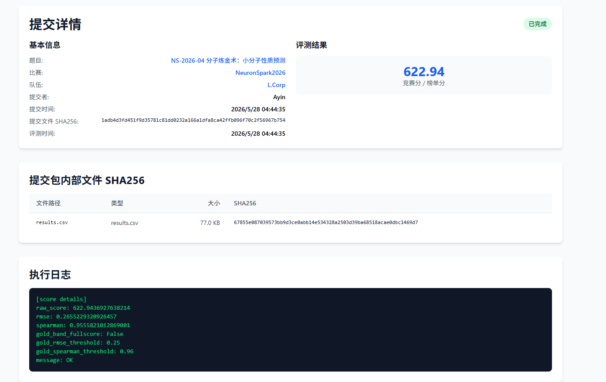
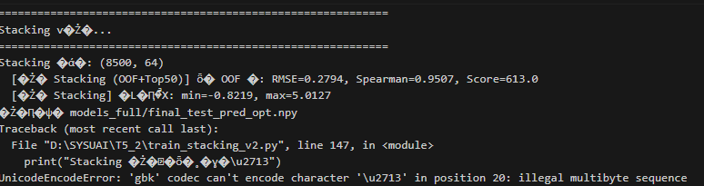
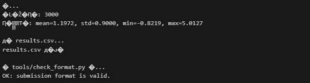
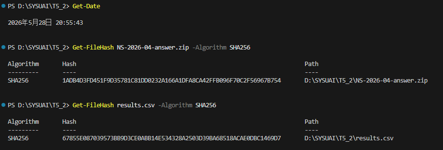

# NS-2026-04 分子炼金术：小分子性质预测 — Writeup

## 1. 基本信息

- **队长用户名**：Ayin
- **队伍名**：L.Corp
- **题号**：NS-2026-04
- **最终官网提交记录**：
  - 提交时间：2026-05-28 04:44:35
  - 最终有效得分：622.94 

  

---

## 2. 解题思路

这题要用 SMILES 字符串预测小分子的物化性质，是个单目标回归任务。最麻烦的地方在于测试集里的分子骨架和训练集差得很远，还要能处理极端高值和少数格式有问题的 SMILES。

最终方案：先写规则把训练集和测试集里格式奇怪的 SMILES 修掉，然后把几种计数型分子指纹取 log 之后拼在一起当特征，用骨架分组交叉验证来估计泛化效果，最后用一个带物理描述符的 BayesianRidge 做 Stacking，主要是为了解决树模型在极端值上容易偏保守的问题。最终线上拿到了 622.94 分。

### 2.1 分子表示

没有用图神经网络，因为 GNN 在骨架分布差异比较大的时候很容易过拟合。最终用的是几类指纹拼在一起：

- **计数型指纹**：Morgan (r=2)、Morgan (r=3)、Topological Torsion、Atom Pairs，各 2048 维，频次用 `log1p` 平滑。这类指纹记录的是官能团出现了几次，不只是"有没有"，对回归任务更有用。
- **二值型指纹**：MACCS Keys（167维）、RDKit Path-based FP（2048维）、Avalon FP（2048维）。
- **RDKit 2D 物化描述符**：208 维，用 RobustScaler 标准化后截到 `[-5, 5]`。

拼完总特征维度是 **14,711**，局部官能团信息和整体物化性质都覆盖到了。

### 2.2 验证方式

用的是**骨架分组 5 折交叉验证（GroupKFold）**，不是随机切分。

先用 RDKit 的 `MurckoScaffold` 给 8500 条训练样本算 Bemis-Murcko 骨架，然后把相同骨架的分子强制分在同一折。这样每折的验证集和训练集里没有同骨架的分子，验证结果能真实反映模型在没见过的骨架上的表现，而不是让模型靠"骨架相似"蒙混过关。

5 折跑完之后能得到覆盖全部 8500 条样本的 Out-Of-Fold 预测，所有消融实验和 Stacking 超参的调整都是看这个 OOF 的 RMSE 和 Spearman 来判断的。

### 2.3 目标值分布

训练集的 target 均值是 **1.21**，标准差 **0.94**，范围 **-1.59 到 7.46**。分布右偏比较明显，大多数分子集中在 `[-1.0, 4.0]`，超过 4.5 的很少。这导致树模型在高值区域预测比较保守，容易往均值缩，Stacking 里加物理描述符就是为了解这个问题。

---

## 3. 主要改进和实验结果

方案迭代过程中，以下三个改动对线上泛化帮助最大：

### 1 把二值指纹换成计数指纹，频次取 log

- **改了什么**：把 Morgan(r=2,3)、Topological Torsion、Atom Pairs 的 bit 指纹换成 count 指纹，频次用 `log1p` 处理。
- **效果**：本地 1700 条验证集上，Stacking 的 RMSE 从 0.2800 降到了 **0.2707**，Spearman 从 0.9399 涨到了 **0.9524**。官能团出现几次对目标值确实有意义，光知道"有没有"不够用。

### 2 换成全量骨架 GroupKFold 交叉验证

- **改了什么**：不再固定留 1700 条做验证集，改成对全部 8500 条做骨架分组 5 折交叉。
- **效果**：线上得分从 623.06 涨到 **623.96**。全量训练让模型见到了更多种类的骨架，泛化性更好。

### 3 Stacking 里加入 Top 50 物理描述符

- **改了什么**：在基模型的 OOF 预测之外，额外拼接与目标值相关性最强的 50 个 RDKit 2D 描述符，用 `BayesianRidge` 做元回归。
- **效果**：本地全量 OOF RMSE 从 0.2886 降到了 **0.2794**，Spearman 升到 **0.9507**。元学习器拿到描述符之后有了线性外推的能力，预测超出树模型"历史经验"的极端高值时不再一味往均值靠。

### 预测失败案例分析

从全量 OOF 预测里找了误差最大的三个样本来看看模型在哪里出了问题：

1. **全氟稠环烷烃（`mol_train_07165`）**
   - **SMILES**：`FC1(F)C(F)(F)C(F)(F)C2(F)C(F)(C1(F)F)C(F)(F)C(F)(F)C1(F)C(F)(F)C(F)(F)C(F)(F)C(F)(F)C12F`
   - **真实值**：`7.4558` | **预测值**：`4.4005` | **误差**：`3.0553`
   - **分析**：这是训练集里目标值最高的分子（7.46），所有氢都被氟替换的稠环结构。这类高氟稠环在训练集里几乎没有，属于极端长尾。树模型没法做特征外推，Stacking 加了描述符也还是低估了不少。

2. **全氟直链烷烃（`mol_train_01309`）**
   - **SMILES**：`FC(F)(F)C(F)(F)C(F)(F)C(F)(F)C(F)(F)C(F)(F)C(F)(F)C(F)(F)C(F)(F)C(F)(F)F`
   - **真实值**：`5.6748` | **预测值**：`3.7534` | **误差**：`1.9214`
   - **分析**：全氟癸烷，长链氟碳。和上面一样，这类结构太少见，模型没学好，预测偏低。

3. **放射性同位素标记分子（`mol_train_01998`）**
   - **SMILES**：`c1c2c(c(c(c1[131I])[O-])[131I])Oc3c(cc(c(c3[131I])[O-])[131I])C24c5c(c(c(c(c5Cl)Cl)Cl)Cl)C(=O)O4`
   - **真实值**：`4.8691` | **预测值**：`3.1998` | **误差**：`1.6693`
   - **分析**：含放射性同位素 `[131I]`（碘-131）的高氯代染料衍生物。Morgan 指纹会把 `[131I]` 识别成和普通碘完全不同的子结构，但这种原子在训练集里几乎没出现过，对应的指纹位基本是空的，模型把它当噪声处理了。

---

## 4. 复现说明

### 运行环境

| 项目              | 信息                                 |
| ----------------- | ------------------------------------ |
| 操作系统          | Windows 11                           |
| Python 版本       | 3.12.11                              |
| PyTorch 版本      | 2.7.1+cu128                          |
| RDKit 版本        | 2026.3.2                            |
| LightGBM 版本     | 4.6.0                                |
| XGBoost 版本      | 3.2.0                                |
| CatBoost 版本     | 1.2.10                               |
| scikit-learn 版本 | 1.7.0                                |
| CPU 型号          | AMD Ryzen 7 9800X3D 8-Core Processor |
| GPU 型号          | NVIDIA RTX 5090                      |
| 内存 (RAM)        | 48 GB                                |
| CUDA 版本         | 13.2                                 |

### 随机种子与核心超参数

- **随机种子**：全程固定 `SEED=42`
- **交叉验证**：5 折 GroupKFold（按 Murcko Scaffold 分组）
- **LightGBM**：`num_leaves=63`, `max_depth=8`, `learning_rate=0.02`
- **XGBoost**：`max_depth=6`, `learning_rate=0.015`
- **CatBoost**：`depth=6`, `learning_rate=0.025`
- **MLP**：`hidden_dims=(1024, 512, 256)`, `dropout=0.4`
- **Stacking 描述符**：与目标值相关性排名前 50 的 RDKit 2D 描述符
- **Stacking 元回归器**：`BayesianRidge()`

### 预计运行时间

- **特征提取**：约 2 分钟，纯 CPU
- **5 折基模型训练**：约 15–20 分钟，GPU 显存约 6GB
- **Stacking 元回归与推理**：几秒，内存占用很小

### 数据预处理

训练集和测试集里有少量格式有问题的 SMILES，由 `fix_smiles.py` 自动分级修复。主要有三类问题：

1. **铝原子价超限**：SMILES 里出现 `[AlH3]` 这种非标准价态，RDKit 解析会报错。用正则替换成 `[Al]` 即可。
2. **氮原子显式 H 导致价超限**：脒/胍基等结构中显式写了 `[NH2]` 或 `[NH]` 导致价态不合法，去掉显式 H 让 RDKit 自动填充。
3. **重过渡金属配位价报错**：含铂 `[Pt]` 的配合物有时会让 RDKit 报错，用 `sanitize=False` 宽松模式加载能正常通过，不影响指纹计算。

### 复现步骤

```bash
# 1. 安装依赖
pip install rdkit lightgbm xgboost catboost scikit-learn pandas torch tqdm

# 2. 特征提取（修复 SMILES，计算 log1p 计数指纹与 RobustScaler 描述符）
python src/build_features_v2.py

# 3. 基模型训练（骨架 GroupKFold 5 折，生成全量 OOF）
python src/train_model_full.py

# 4. Stacking（拼接 OOF + Top 50 描述符，训练 BayesianRidge，输出测试集预测）
python src/train_stacking_v2.py

# 5. 打包提交（生成 results.csv，格式检查，打包）
python src/predict_and_submit_full_opt.py
```

### 外部数据与开源库声明

- **外部预训练模型或外部数据**：无。没用任何外部分子预训练模型或第三方数据。
- **化学库**：用了 **RDKit（版本 2026.3.2）**，BSD 开源许可。所有特征都是从 SMILES 本地算出来的，不存在测试标签泄露的风险。

---

## 5. AI 使用声明

### 全局说明

- 本队使用的 AI 工具：Gemini、Claude
- 主要用途：资料查询 / 代码辅助

### 逐题声明

#### NS-2026-04

- 官方等级：A1
- 实际使用：资料查询 / 代码辅助
- AI 是否接触完整题面：是
- AI 是否接触测试输入：否
- AI 是否接触提交反馈或排行榜反馈：否
- AI 是否生成或修改最终提交：否
- 是否使用商业 API、闭源远程模型或托管式 Agent：是
- 详细说明：使用了 Gemini 和 Claude 两个闭源远程模型，主要用于资料查询和代码辅助，还有相关专业化学知识解答和业界常用处理方式

### Writeup 写作辅助声明

- 是否使用 AI 辅助撰写或润色：是
- 使用工具：Gemini
- 使用范围：语言润色 / Markdown 排版 / 根据本队实验记录整理段落
- AI 接触材料：代码片段 / Writeup 要求
- AI 是否生成新的实验结果、验证分数或复现命令：否
- 人工核对方式：队伍成员核对事实、代码、日志、分数和复现命令

---

## 6. 最终提交与 SHA256

- **平台提交文件名称**：NS-2026-04-answer.zip
- **平台提交时间**：2026-05-28 04:44:35
- **最终有效得分**：622.94
- **答案 ZIP SHA256（提交文件 SHA256）**：1adb4d3fd451f9d35781c81dd0232a166a1dfa8ca42ffb096f70c2f56967b754
- **内部关键文件 SHA256（提交包内部 SHA256）**：
  - `results.csv`：67855e087039573bb9d3ce0abb14e534328a2503d39ba68518acae0dbc1469d7
- **模型文件清单**：./models/stack_models_opt.pkl

- **补充说明**：夜里想冲一下榜，但是忘了备份旧版，只能交最终版本，比之前最高分低一点。

---

## 7. 证据截图


部分日志因为编码问题显示乱码（GBK 和 UTF-8 的问题），但评估指标等关键数据都是正常的。







---

## 8. 代码包

代码包包含以下文件：

```
Ayin-NS-04/
├── README.md            # 本文件，含复现步骤
├── requirements.txt     # Python 依赖
├── evidence/            # 证据截图
│   ├── submission.png
│   ├── log_train.png
│   ├── log_predict.png
│   └── sha256.png
├── submission/
│   └── NS-2026-04-answer.zip
├── models/              # 训练好的核心模型
│   └── stack_models_opt.pkl
└── src/                 # 源码
    ├── fix_smiles.py
    ├── build_features_v2.py
    ├── train_model_full.py
    ├── train_stacking_v2.py
    └── predict_and_submit_full_opt.py
```