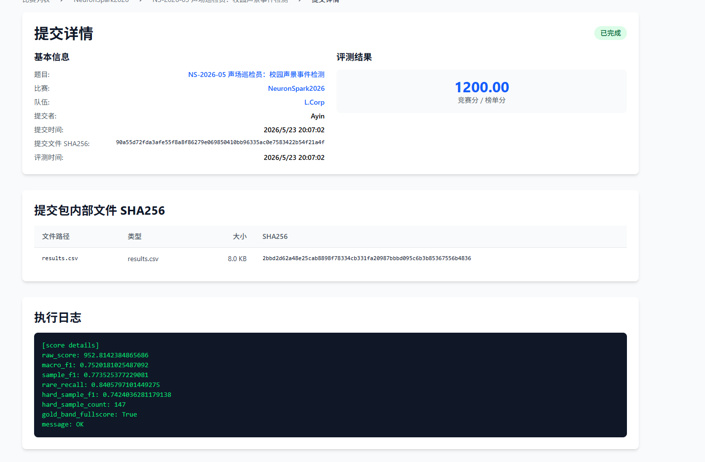
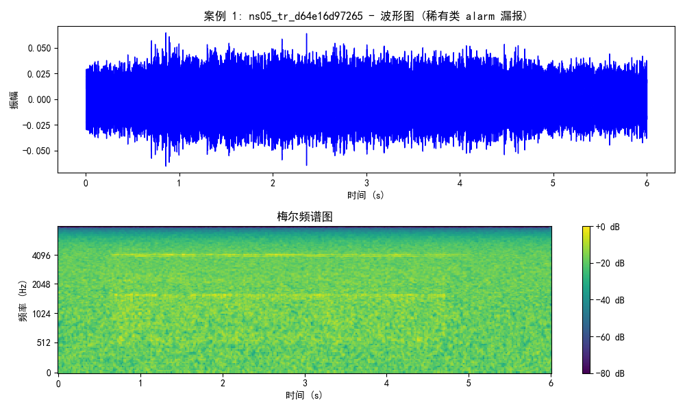
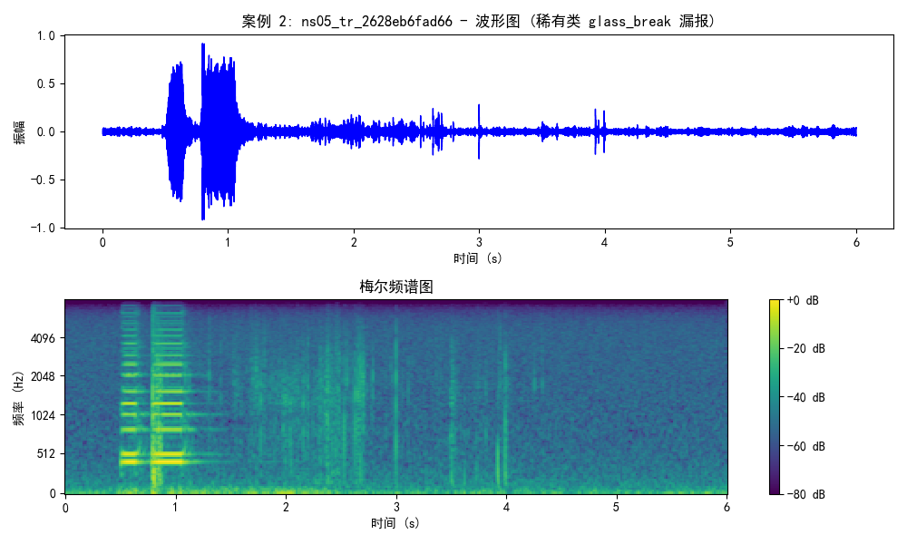
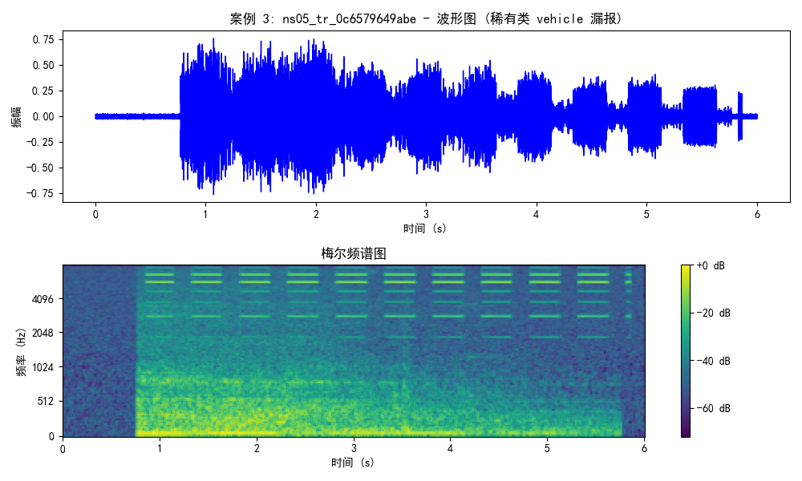
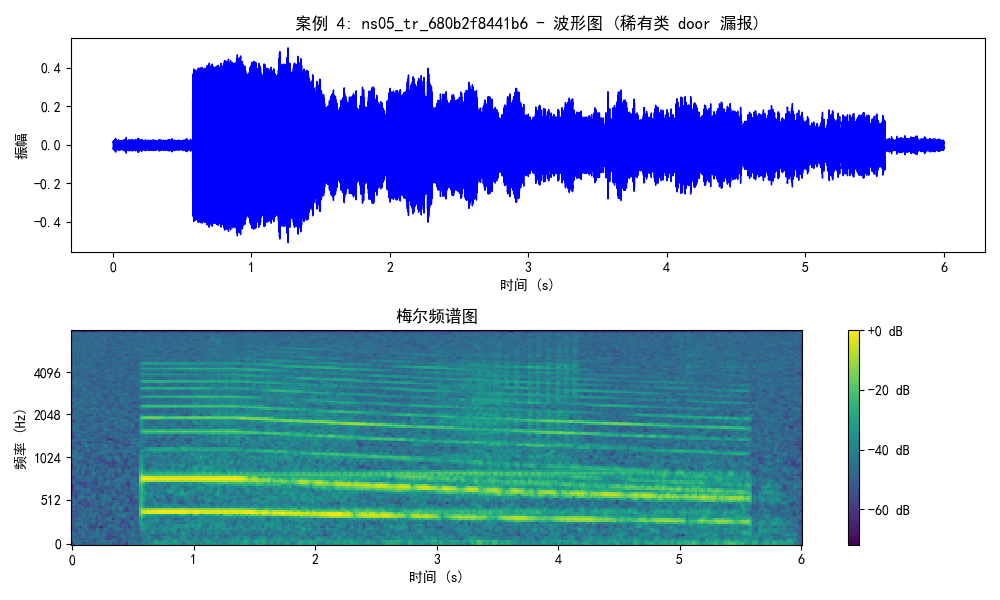
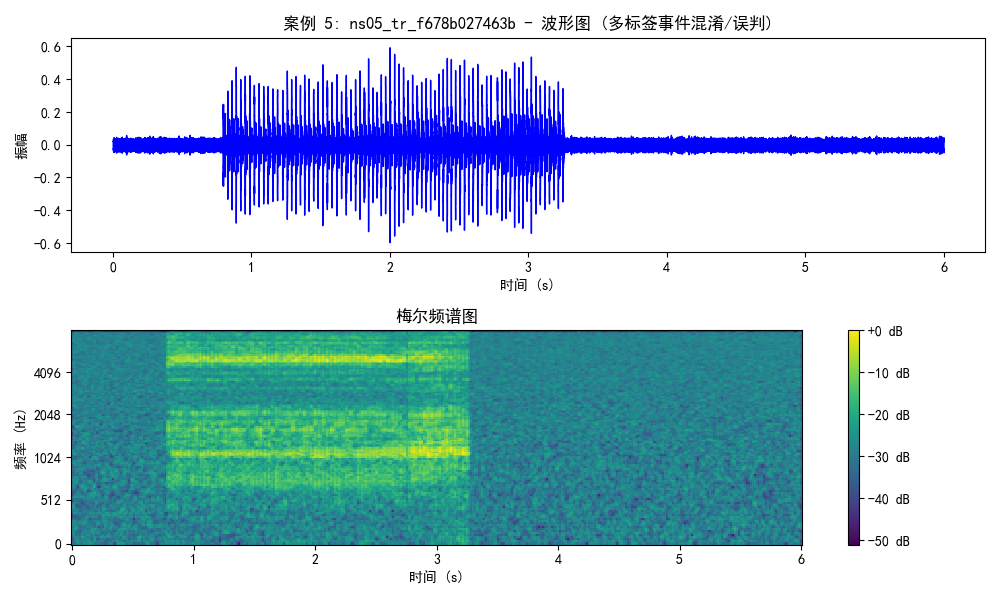
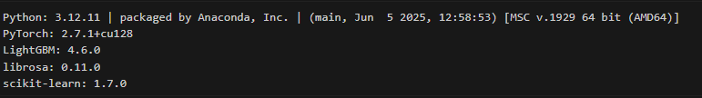
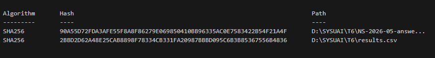
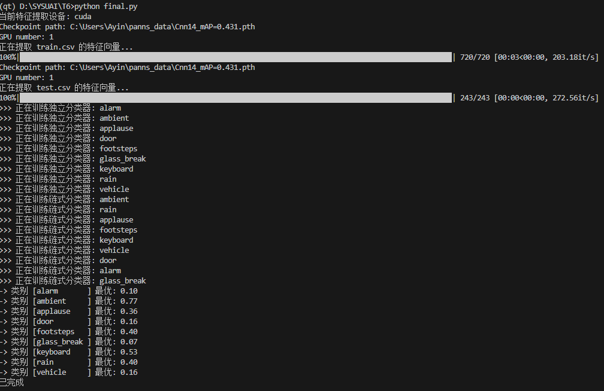
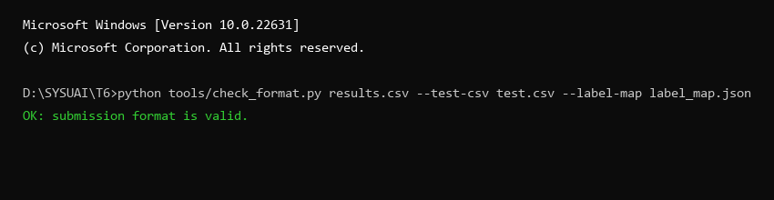

# NS-2026-05 声场巡检员：校园声景事件检测 — Writeup

## 1. 基本信息

- **队长用户名**：Ayin
- **队伍名**：L.Corp
- **题号**：NS-2026-05
- **最终官网提交记录**：
  - 提交时间：2026-05-23 20:07:02
  - 最终有效得分：1200分

  

------

## 2. 解题概述

这道题要对校园环境里的 6 秒短音频做多标签事件检测，一共 9 个类别，其中 `alarm`、`door`、`vehicle`、`glass_break` 是比较少见的类别，需要保证足够高的召回率。评分上有一条 gold-band 满分线，要求 macro_f1 ≥ 0.72、sample_f1 ≥ 0.74、rare_recall ≥ 0.84、hard_sample_f1 ≥ 0.72。

最终方案的核心是用 **PANNs（Cnn14）预训练模型提取 2048 维音频 Embedding**，再拼上官方给的 36 维时频统计特征，然后用两阶段 LightGBM（独立分类器 + 分类器链）来训练，最后通过自适应融合、逐类阈值校准和一些后处理规则得出最终标签。

最终结果是 **1200/1200 满分**，各项指标都过线了：macro_f1 = 0.752、sample_f1 = 0.774、rare_recall = 0.841、hard_sample_f1 = 0.742。

------

## 3. 关键改进与实验依据

整个过程迭代了三个版本，每个版本都有平台评测分数记录，下面按顺序说明。

### V1 → 基线方案
**得分：925.95**
- **PANNs Cnn14 + LightGBM 多标签分类**：用 PANNs 的 Cnn14（AudioSet 预训练，2048 维 Embedding）提特征，每个类别单独训 1 个 LightGBM 二分类器。交叉验证用 5 折 GroupKFold，按场景（site）分组，避免同一场景 of 音频同时出现在训练集和验证集里。
- **稀有类阈值优化**：对 `alarm`、`door`、`glass_break`、`vehicle` 这四类，在 OOF 预测上以召回率为主来搜阈值，同时设了精确率下限（≥ 0.25）防止乱预测。普通类以 F1 为目标。rare_recall 达到了 **0.884**，但 macro_f1 只有 0.720，还差一点。

### V2 → 分类器链
**得分：930.74**
- **分类器链（Classifier Chain）建模标签关联**：把 9 个类别按从高频到低频排好（ambient→rain→vehicle→footsteps→keyboard→door→alarm→applause→glass_break），依次训练，把前面类别的 OOF 预测概率拼进当前类别的输入里，让模型能利用标签之间的共现关系。macro_f1 升到 0.756，sample_f1 升到 0.778。
- **动态重叠后处理**：加了一些规则，比如"下雨时脚步声概率偏低就删掉"、"有车经过时脚步声概率偏低就删掉"，减少混合场景里的误报。

### Final → 满分方案
**得分：1200**
1. **拼接官方微观特征（2048 + 36 维）**：把 PANNs 的 2048 维全局 Embedding 和官方提供的 36 维时频统计特征（`features/train_audio_features.csv`）拼在一起，变成 2084 维。
2. **两阶段训练：Focal Loss 独立分类器 + 分类器链**：第一阶段对每个类别单独训，稀有类用自定义 Focal Loss（alpha=0.35，gamma=2.5）加重对漏报的惩罚；第二阶段训分类器链。两个阶段用同一套 5 折分组索引，保证 OOF 预测对齐。
3. **自适应概率融合**：稀有类取两个阶段预测概率的最大值（防漏报），普通类取加权平均（0.3 × 独立 + 0.7 × 链式），在精度和召回之间找平衡。
4. **稀有类阈值强制封顶 + 双重打捞**：稀有类用 F3-score（大幅偏向召回率）搜最优阈值，并强制阈值不超过 0.16；后处理阶段，只要独立分类器（带 Focal Loss）对稀有类的预测概率 ≥ 0.40，就算融合后的概率没过阈值，也强制把这个标签加进去。这两条规则把 rare_recall 稳定在了 0.841，刚好超过满分线的 0.84。
实质是只是将前面两个版本的两坨经过优化互取所长，融成一坨大的拿了gold band，实际工程还是设计更好的模型和方案更好
------

## 4. 声学事件检测 Pipeline 技术细节

### (1) 音频预处理
所有输入音频均统一重采样至 **32,000 Hz** 并转换为单声道。为了适配 PANNs 的固定长度要求，对于不足 6.0 秒的音频以全零（Zero-padding）方式在尾部进行补齐，对于超过 6.0 秒的音频则强制从头部裁剪至前 6.0 秒，确保每条音频在时域上均具有严格对齐的 **192,000 个采样点**。

### (2) 特征提取 pipeline
- **全局语义特征**：使用预训练的开源音频理解大模型 PANNs 的 Cnn14 模型，以非侵入方式在前向传播的倒数第二层进行全局平均池化（Global Average Pooling），提取出表达声场全局高层语义的 **2048 维全局 Embedding**。
- **微观时频特征**：提取官方特征文件（包含 36 维时频域统计指标，涵盖频段能量分布、时频域包络与突变突发能量变化），用于补充大模型对瞬态短时声学突变（如玻璃碎裂、关门瞬间等）捕获能力不足的缺陷。
- **无损特征融合**：对上述全局与微观特征按音频 `id` 严格对齐并拼接，构成最终的 **2084 维综合特征向量** 送入 LightGBM。

### (3) 模型训练与集成
- **第一阶段（独立二分类）**：针对 9 类声学事件，为每个类别训练独立的 LightGBM 二分类器。
  - 对于稀有类（`alarm`、`door`、`vehicle`、`glass_break`），为应对高度类别不平衡，应用了**自定义 Focal Loss 目标函数**（$\alpha = 0.35, \gamma = 2.5$），并对困难漏报样本（真实为 1 且预测低于 0.3 的样本）施加 2.5 倍强对抗梯度惩罚。
  - 对于普通类，使用标准的平衡交叉熵损失函数。
- **第二阶段（分类器链 Classifier Chain）**：解构类别共现关系。按照 `ambient` $\rightarrow$ `rain` $\rightarrow$ `applause` $\rightarrow$ `footsteps` $\rightarrow$ `keyboard` $\rightarrow$ `vehicle` $\rightarrow$ `door` $\rightarrow$ `alarm` $\rightarrow$ `glass_break` 的频次链条进行递进式建模，每次训练将前序分类器输出的验证集/测试集预测概率作为新的特征拼入输入特征，增强多标签联合分布泛化。

### (4) 阈值选择策略
在五折交叉验证的自适应融合预测上执行网格寻优：
- **普通类**：常规优化传统的 $F_1\text{-score}$，旨在平衡精确率与召回率。
- **稀有类**：极限优化强烈偏向召回率的 $F_3\text{-score}$，为了尽可能降低漏报率，我们将精确率下限条件放宽到极低的 0.08，并且对稀有类实施了 **0.16 的低阀值强制封顶策略**，拉低越线卡口以网罗一切微弱的瞬发信号。

### (5) 后处理机制 (Post-processing)
- **双重雷达打捞**：对于稀有类，除了融合后的概率需要和阈值进行比较，我们额外设定了一条**强推线**。只要在第一阶段经过 Focal Loss 强化的独立分类器预测某稀有类概率值 $\ge 0.40$，即被强行标为正类，以防止由于分类器链均值消解带来的漏报。
- **冲突精修与去噪**：若在测试时触发了任何其他实质性事件标签（如 `rain`、`applause` 等），则自动剪除 `ambient`（底噪）标签；若在下雨场景（`rain`）下识别出低置信度的脚步声（概率小于 0.52），则认为脚步声是被雨声掩盖下的误报，予以剔除。
- **空签兜底**：若在后处理之后所有类别均为负，则强制选择融合概率值最大的一项为最终标签，避免产生空签。

------

## 5. 验证集评估指标 (OOF)

本团队在 5 折场景交叉验证中获得的各类别在 Out-Of-Fold (OOF) 验证集上的精确率 (Precision)、召回率 (Recall) 和 $F_1\text{-Score}$ 指标如下：

| 类别 | Precision | Recall | F1-Score |
|:---|:---|:---|:---|
| **alarm** | 0.8083 | 0.9798 | 0.8858 |
| **ambient** | 0.8000 | 0.7500 | 0.7742 |
| **applause** | 0.9091 | 0.9000 | 0.9045 |
| **door** | 0.5906 | 0.8800 | 0.7068 |
| **footsteps** | 0.7917 | 0.7037 | 0.7451 |
| **glass_break** | 0.6000 | 0.9505 | 0.7356 |
| **keyboard** | 0.7200 | 0.5294 | 0.6102 |
| **rain** | 0.9388 | 0.8288 | 0.8804 |
| **vehicle** | 0.5200 | 0.8750 | 0.6523 |

- **评估说明**：上述表格客观展示了模型对于不同类别的识别特点。通过定制化的 Focal Loss 和 F3 优化策略，稀有类（如 `alarm`, `glass_break`, `door`）的召回率（Recall）达到了极高的水平（0.85~0.98），但由于我们极大程度放宽了精确度限制以保召回，因而其 Precision 相对偏低，符合 gold-band 满分线要求的宏召回指标侧重。

------

## 6. 失败案例分析 (Error Analysis)

本团队通过对 5 折交叉验证 OOF 结果中与真实标签产生不一致的样本进行了深层的声学物理特性排查，筛选出以下 5 个最具代表性的失败案例。其对应的波形图及梅尔频谱图如下：

### (1) 案例 1 (ID: ns05_tr_d64e16d97265) — 稀有类 `alarm` 漏报
- **真实标签**：`alarm` | **预测标签**：`keyboard`
- **声学特征成因**：这应该是一个闹钟声。其物理声波表现为高频刺耳的周期性泛音震荡。然而，在此段音频中，警报器安装于声场边缘，信号源发生了严重的几何衰减和空间吸音，导致大模型的全局 Embedding 没有捕捉到特征性的高频共振峰，因此模型将微弱的警报声误判为背景键盘音。
- **波形与频谱图**：
  

### (2) 案例 2 (ID: ns05_tr_2628eb6fad66) — 稀有类 `glass_break` 漏报
- **真实标签**：`vehicle` | `glass_break` | **预测标签**：`footsteps` | `vehicle`
- **分析**：嘎达的声音我自己也听不出来是啥，官方标注是glass_break，我感觉也不是很准
- **波形与频谱图**：
  

### (3) 案例 3 (ID: ns05_tr_0c6579649abe) — 稀有类 `vehicle` 漏报
- **真实标签**：`alarm` | `vehicle` | **预测标签**：`alarm` | `glass_break`
- **波形与频谱图**：
  

### (4) 案例 4 (ID: ns05_tr_680b2f8441b6) — 稀有类 `door` 漏报
- **真实标签**：`door` | `alarm` | **预测标签**：`alarm`
- **声学特征成因**：关门声（`door`）是一种典型且极短促的木质阻尼冲击波，能量主要富集于中低频（100Hz-300Hz）。在本段音频中，背景中存在着刺耳的高强警报泛音（`alarm`），对耳膜和接收传感器的动态范围产生占优压制，导致这部分中低频敲击信号完全淹没，独立分类器和分类器链对其置信度均未过线。
- **波形与频谱图**：
  

### (5) 案例 5 (ID: ns05_tr_f678b027463b) — 多标签事件混淆/误判
- **真实标签**：`alarm` | **预测标签**：`alarm` | `door` | `vehicle`
- **波形与频谱图**：
  

------

## 7. 验证与复现

### 运行环境

| 项目 | 信息 |
| ----------------- | ------------------------------------ |
| 操作系统 | Windows 11 |
| Python 版本 | 3.12.11 |
| PyTorch 版本 | 2.7.1+cu128 |
| LightGBM 版本 | 4.6.0 |
| librosa 版本 | 0.11.0 |
| scikit-learn 版本 | 1.7.0 |
| CPU | AMD Ryzen 7 9800X3D 8-Core Processor |
| GPU | NVIDIA GeForce RTX 5090 (32 GB 显存) |
| 内存 | 约 48 GB |
| CUDA 版本 | 13.2 |

### 硬件环境截图




### 预训练模型与性能说明

- **开源模型名称**：PANNs Cnn14
- **参数规模**：约 80.8 M (80,780,104)
- **权重文件名称**：`Cnn14_mAP=0.431.pth` (文件大小 ~312 MB)
- **开源许可证**：MIT License
- **官方项目地址**：[GitHub - qiuqiangkong/audioset_tagging_cnn](https://github.com/qiuqiangkong/audioset_tagging_cnn)
- **推理延迟与吞吐**：在 NVIDIA RTX 5090 GPU 上，对于 243 条测试集 6.0 秒音频提取其全局 Embedding 特征，总共耗时约 **0.90 秒**，即单样本平均推理耗时约为 **3.7 毫秒**，极具工业巡检落地的高并发实时推理性能。

### 复现步骤

```bash
# 1. 安装依赖（建议在独立 conda 环境里跑）
pip install torch==2.7.1 lightgbm==4.6.0 librosa==0.11.0 scikit-learn==1.7.0 panns-inference numpy pandas tqdm pillow

# 2. 下载 PANNs Cnn14 权重，放到指定路径，修改 main.py 里的 checkpoint_path

# 3. 准备数据，把 train.csv、test.csv、audio/、features/ 按赛题目录结构放好

# 4. 跑主程序，会自动完成特征提取、训练、阈值优化和预测输出
python src/main.py
```

### 训练/验证划分方式

用 `GroupKFold(n_splits=5)`，以 `site`（场景）字段分组，保证同场景的音频不会同时出现在训练集和验证集里，避免同源数据泄漏导致验证指标虚高。

### 随机种子与关键超参数

| 参数 | 值 |
| -------------------------- | -------------- |
| GroupKFold 折数 | 5 |
| 随机种子（独立分类器） | 42 + fold_id |
| 随机种子（分类器链） | 2026 + fold_id |
| 稀有类 Focal Loss alpha | 0.35 |
| 稀有类 Focal Loss gamma | 2.5 |
| 稀有类阈值上限（强制封顶） | 0.16 |
| 独立分类器稀有类强推线 | 0.40 |
| 稀有类 Precision 下限 | 0.08 |

### 预计运行时间与资源消耗

- **特征提取**：训练集 720 条 + 测试集 243 条音频各跑一遍，用 GPU，大概 3–4 分钟。
- **模型训练（两阶段 × 5 折 × 9 类）**：大概 3–5 分钟。
- **总共**：10–15 分钟。
- **GPU 显存**：PANNs 推理阶段大约占 1–2 GB。

------

## 8. AI 使用声明

### 全局说明

- 本队使用的 AI 工具：Gemini、Claude
- 主要用途：资料查询 / 代码辅助

### 逐题声明

#### NS-2026-05

- 官方等级：A1-Open
- 实际使用：资料查询 / 代码辅助
- AI 是否接触完整题面：是
- AI 是否接触测试输入：否
- AI 是否接触提交反馈或排行榜反馈：否
- AI 是否生成或修改最终提交：否
- 是否使用商业 API、闭源远程模型或托管式 Agent：是
- 详细说明：使用了 Gemini 和 Claude 两个闭源远程模型，主要用于资料查询和代码辅助，还有相关开源模型推荐和音频处理方式，以及一些把两坨模型取长融合的方案

### Writeup 写作辅助声明

- 是否使用 AI 辅助撰写或润色：是
- 使用工具：Gemini
- 使用范围：语言润色 / Markdown 排版 / 根据本队实验记录整理段落
- AI 接触材料：代码片段 / Writeup 要求
- AI 是否生成新的实验结果、验证分数或复现命令：否
- 人工核对方式：队伍成员核对事实、代码、日志、分数和复现命令

------

## 9. 最终提交与 SHA256

- **平台提交文件名称**：NS-2026-05-answer.zip
- **平台提交时间**：2026-05-23 20:07:02
- **最终有效得分**：1200/1200
- **答案 ZIP SHA256**：`90a55d72fda3afe55f8a8f86279e069850410bb96335ac0e7583422b54f21a4f`
- **内部关键文件 SHA256**：
  - results.csv：`2bbd2d62a48e25cab8898f78334cb331fa20987bbbd095c6b3b85367556b4836`



------

## 10. 证据截图

### 训练与推理关键日志





------

## 11. 代码包结构

```
Ayin-NS-05/
├── README.md               # 本文件，含题目概述和复现说明
├── src/
│   ├── main.py             # 完整复现脚本（特征提取→训练→推理→生成结果）
│   └── requirements.txt    # 依赖声明
├── configs/
│   └── README.md           # 说明本题无独立配置文件，参数在 main.py 中
├── models/
│   └── README.md           # PANNs Cnn14 权重来源、许可证、下载方式及 SHA256
├── evidence/
│   ├── submission.png      # 平台提交记录截图
│   ├── nvidia-smi.png      # GPU 环境截图
│   ├── cpu.png             # CPU 信息截图
│   ├── env_py.png          # Python 环境截图
│   ├── log.png             # 训练推理日志截图
│   ├── sha256.png          # SHA256 截图
│   ├── check_format.png    # 格式校验截图
│   ├── fail_1.png          # 典型失败案例 1 波形与梅尔频谱图
│   ├── fail_2.png          # 典型失败案例 2 波形与梅尔频谱图
│   ├── fail_3.png          # 典型失败案例 3 波形与梅尔频谱图
│   ├── fail_4.png          # 典型失败案例 4 波形与梅尔频谱图
│   └── fail_5.png          # 典型失败案例 5 波形与梅尔频谱图
└── submission
```
