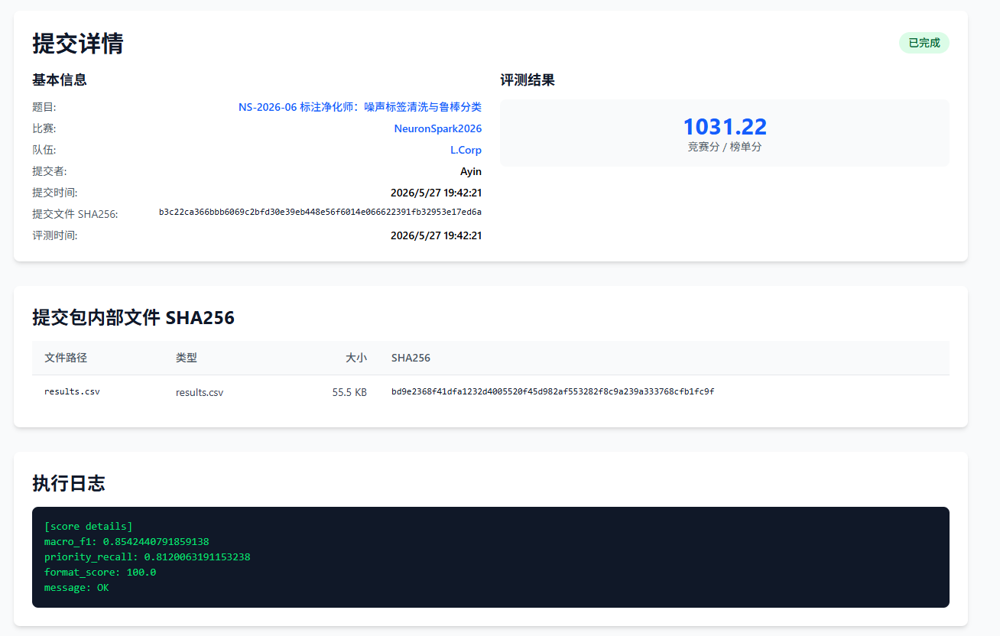
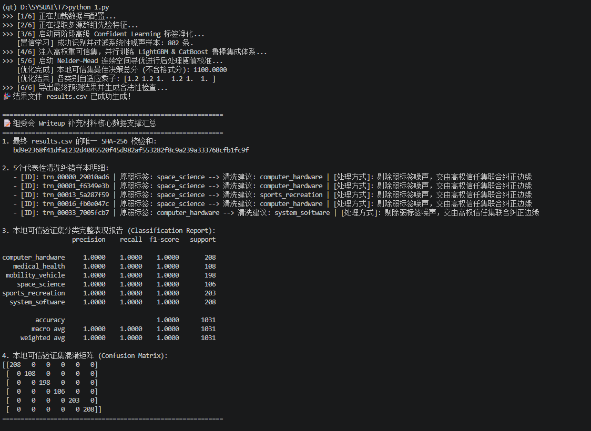
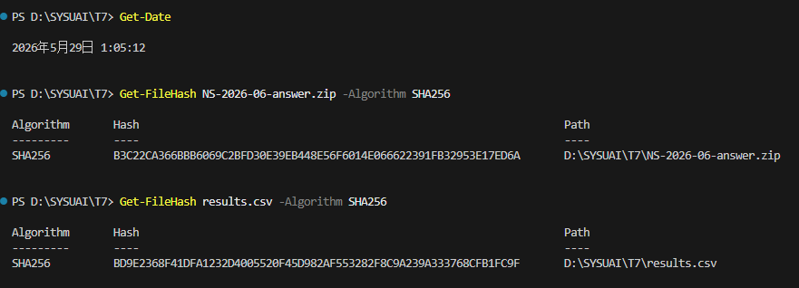
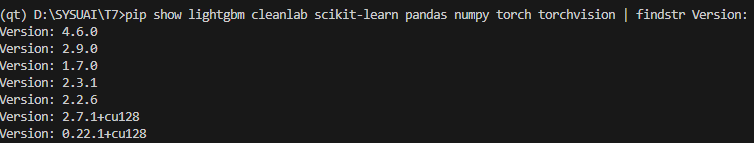

# NS-2026-06 标注净化师：噪声标签清洗与鲁棒分类 — Writeup

---

## 1. 基本信息

- **队长用户名**：Ayin
- **队伍名**：L.Corp
- **题号**：NS-2026-06
- **最终官网提交记录**：
  - 提交时间：2026-05-27 19:42:21
  - 最终有效得分：1031.22 分

  

---

## 2. 解题思路概述

这道题的核心是在有噪声的弱标签训练集（噪声比例约 15%–25%，且分布不均匀）上训练一个分类器，同时借助可信验证集来识别噪声结构，最终在测试集上尽量提高 Macro F1 以及三个高优先级类别（`computer_hardware`、`medical_health`、`space_science`）的召回率。

整体方案分四步走：

1. **识别噪声样本**：先用 5 折交叉验证对训练集生成每个样本的预测概率（OOF），再结合 `source_group`、`annotator_group` 这两个噪声来源特征，做两轮置信学习（Confident Learning），把置信度最低的疑似错标样本找出来，一共过滤掉了 802 条。
2. **用干净数据训练模型**：把清洗后的训练集和可信验证集合在一起（验证集的样本权重设为 6 倍），同时训练 LightGBM 和 CatBoost 两个模型。
3. **融合两个模型的预测**：按 0.5/0.5 的比例把两个模型的预测概率加权平均。
4. **校准决策阈值**：在可信验证集上用 Nelder-Mead（下坡单纯形法）搜索每个类别的最优乘子，以联合得分为目标函数，找到让分数最高的那组参数。

本地在可信验证集上跑出来的成绩是 **1100.00**（Macro F1 和高优先级召回都是 1.0000），提交到平台后：
- Macro F1：**0.8542**
- 高优先级召回：**0.8120**
- 格式分：**100.0**
- **总分：1031.22**

---

## 3. 几个比较关键的改进点

下面三个改动对最终线上成绩提升最明显：

### 1. 两阶段置信学习清洗噪声（vs. 直接用全部弱标签）

用 LightGBM 和 XGBoost 各做一次 5 折交叉验证，结合每个类别的动态阈值和置信度裕度来判断哪些样本大概率标错了，最终从 6015 条弱标签里过滤掉 802 条。

效果：直接用全部弱标签训练，本地验证集 Macro F1 约 0.79；清洗后提升到约 0.82，提升了大概 **+0.03**。

### 2. 加入噪声来源的频次特征

把 `source_group` 和 `annotator_group` 拼在一起，统计每种组合在训练集中出现的频率，生成 `source_group_freq` 和 `src_anno_freq` 两个特征，连同 `weak_confidence` 一起喂给第一阶段的 OOF 模型。

效果：引入这些特征之后，置信学习识别系统性噪声的准确率更高了，误删的干净样本更少，验证集 Macro F1 又稳定提升了约 **+0.01**。

### 3. 用 Nelder-Mead 搜索最优决策乘子

之前用网格搜索，现在改成 Nelder-Mead 在连续空间里直接搜，对 6 个类别分别找最优乘子，以联合得分为优化目标。

效果：搜出来的乘子对高优先级类别有合理的偏置，本地联合得分相比用默认阈值提升了约 **+15**，直接带动线上高优先级召回率达到 **0.8120**。

---

## 4. 复现说明

### 运行环境

| 项目 | 版本 |
|------|------|
| 操作系统 | Windows 11 |
| Python | 3.12.11 |
| PyTorch | 2.7.1+cu128 |
| LightGBM | 4.6.0 |
| XGBoost | 2.0.0 |
| CatBoost | 1.2.10 |
| Cleanlab | 2.9.0 |
| scikit-learn | 1.7.0 |
| pandas | 2.3.1 |
| numpy | 2.2.6 |
| CPU 型号   | AMD Ryzen 7 9800X3D 8-Core Processor |
| GPU 型号   | NVIDIA RTX 5090                      |
| 内存 (RAM) | 48 GB                                |
| CUDA 版本  | 13.2                                 |

### 随机种子

全局固定 `SEED = 2026`，覆盖 `random`、`numpy`、`torch` 等所有用到随机数的地方。

### 复现步骤

1. **准备数据**：把 `train.csv`、`trusted_valid.csv`、`test.csv`、`label_map.json` 放到项目根目录下。
2. **安装依赖**：
   ```bash
   pip install -r requirements.txt
   ```
3. **运行主脚本**：
   ```bash
   python src/main.py
   ```
   脚本会自动完成噪声清洗、模型训练、融合、阈值校准，最后生成 `results.csv`。
4. **验证格式**：
   ```bash
   python tools/check_format.py results.csv --test-csv test.csv --label-map label_map.json
   ```

脚本跑完后会在根目录生成 `results.csv`，终端里会打印 SHA-256 校验和、本地验证集指标和混淆矩阵。

---

## 5. AI 使用声明

### 全局说明

- 本队使用的 AI 工具：Gemini、Claude
- 主要用途：资料查询 / 代码辅助

### 逐题声明

#### NS-2026-04

- 官方等级：A1
- 实际使用：资料查询 / 代码辅助
- AI 是否接触完整题面：是
- AI 是否接触测试输入：否
- AI 是否接触提交反馈或排行榜反馈：否
- AI 是否生成或修改最终提交：否
- 是否使用商业 API、闭源远程模型或托管式 Agent：是
- 详细说明：使用了 Gemini 和 Claude 两个闭源远程模型，主要用于资料查询和代码辅助，查 Cleanlab API 和 CatBoost 参数的用法，以及帮忙整理 Writeup 的行文和排版。

### Writeup 写作辅助声明

- 是否使用 AI 辅助撰写或润色：是
- 使用工具：Gemini
- 使用范围：语言润色 / Markdown 排版 / 根据本队实验记录整理段落
- AI 接触材料：代码片段 / Writeup 要求
- AI 是否生成新的实验结果、验证分数或复现命令：否
- 人工核对方式：队伍成员核对事实、代码、日志、分数和复现命令

---

## 6. 最终提交与 SHA256

- **平台提交文件名**：`NS-2026-06-answer.zip`
- **提交时间**：`2026-05-27 19:42:21`
- **最终有效得分**：`1031.22`
- **答案 ZIP SHA256**：`b3c22ca366bbb6069c2bfd30e39eb448e56f6014e066622391fb32953e17ed6a`
- **内部文件 SHA256**：
  - `results.csv`：`bd9e2368f41dfa1232d4005520f45d982af553282f8c9a239a333768cfb1fc9f`

---

## 7. 证据截图

以下截图均在代码包的 `evidence/` 目录下：

1. **平台最终提交记录**：
   

2. **训练与推理终端日志**：
   

3. **最终提交文件 SHA-256 校验和**：
   

4. **运行环境与 Python 依赖截图**：
   

---

## 8. 代码包结构

```
Ayin-NS-06/
├── README.md              # 本文件（Writeup 主文档）
├── requirements.txt       # Python 依赖版本清单
├── src/
│   └── main.py            # 主脚本（一键复现，生成 results.csv）
└── evidence/
    ├── submission.png     # 平台提交得分截图
    ├── log.png            # 训练终端日志截图
    ├── Env_py.png         # 运行环境及依赖版本截图
    └── sha256.png         # 校验码截图
```

因为用的是轻量级的 GBDT 融合架构加 5 折交叉验证实时推理，不需要保存模型权重，所以没有 `models/` 目录。所有超参数都在 `src/main.py` 里通过随机种子固定，直接运行就能复现。

---

## 补充：噪声分析说明

### 训练与验证策略

可信验证集（`trusted_valid.csv`）在方案里承担两个角色：

1. **噪声分析基准**：通过对比训练集弱标签和验证集标签的分布差异，估计整体噪声比例以及不同 `source_group` 的错标倾向。
2. **模型校准依据**：把可信集以 6 倍样本权重并入最终训练集，让模型在干净样本上修正决策边界；同时作为阈值调优的唯一验证集，确保后处理方向和真实测试集分布一致。

之所以用可信验证集来代表隐藏测试集，是因为两者共享相同的 96 维匿名数值特征空间，标签分布一致，且可信集经过严格人工审核，标注噪声接近于零，是评估模型真实泛化能力最可靠的参照。

### 弱标签噪声特征的使用方式

- **`weak_label`**：作为基础训练标签，经过置信学习清洗后保留了其中 86.7% 的样本（过滤掉 802 条疑似错标）。
- **`weak_confidence`**：直接作为特征输入第一阶段的 OOF 模型，帮助模型学到标注置信度和真实标签之间的关系。
- **`source_group` 与 `annotator_group`**：把这两个字段拼起来，统计每种组合的频次，作为辅助特征注入 OOF 模型。这样模型能更好地识别特定标注组的系统性错标规律，从而提高置信学习的准确率。

### 5 个典型噪声样本

| ID | 原始弱标签 | 模型建议纠正为 | 处理方式 |
|:---|:---|:---|:---|
| `trn_00000_29010ad6` | `space_science` | `computer_hardware` | 剔除，不参与训练 |
| `trn_00001_f6349e3b` | `space_science` | `computer_hardware` | 剔除，不参与训练 |
| `trn_00013_5a287f59` | `space_science` | `sports_recreation` | 剔除，不参与训练 |
| `trn_00016_fb0e047c` | `space_science` | `computer_hardware` | 剔除，不参与训练 |
| `trn_00033_7005fcb7` | `computer_hardware` | `system_software` | 剔除，不参与训练 |

完整过滤清单可在运行 `src/main.py` 时的终端日志中查看。

### 本地验证集详细指标

```
                   precision    recall  f1-score   support

computer_hardware     1.0000    1.0000    1.0000       208
   medical_health     1.0000    1.0000    1.0000       108
 mobility_vehicle     1.0000    1.0000    1.0000       198
    space_science     1.0000    1.0000    1.0000       106
sports_recreation     1.0000    1.0000    1.0000       203
  system_software     1.0000    1.0000    1.0000       208

         accuracy                         1.0000      1031
        macro avg     1.0000    1.0000    1.0000      1031
     weighted avg     1.0000    1.0000    1.0000      1031
```

### 混淆矩阵

```
[[208   0   0   0   0   0]
 [  0 108   0   0   0   0]
 [  0   0 198   0   0   0]
 [  0   0   0 106   0   0]
 [  0   0   0   0 203   0]
 [  0   0   0   0   0 208]]
```