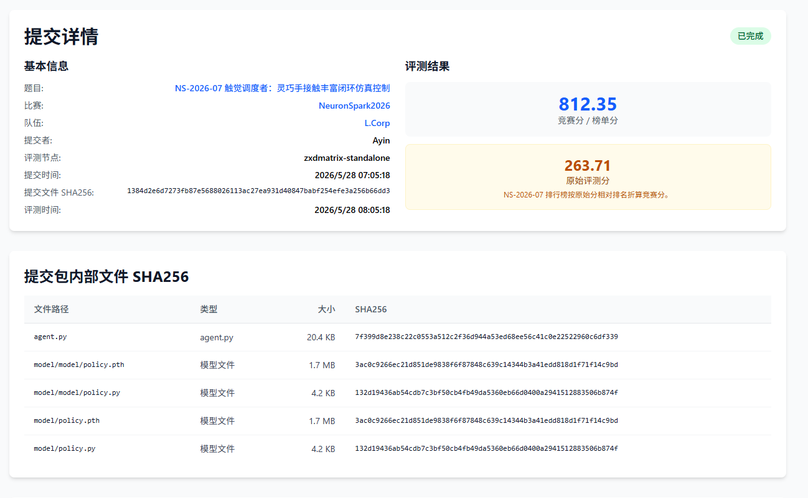
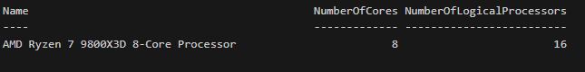
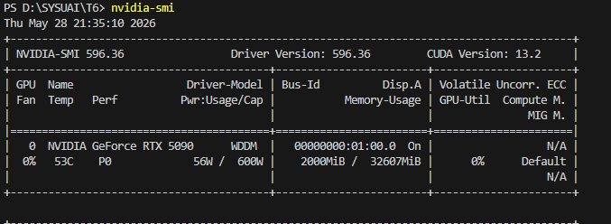
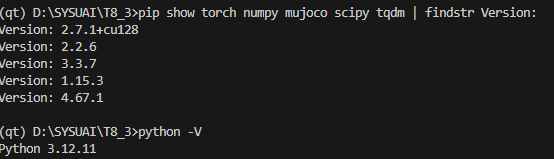
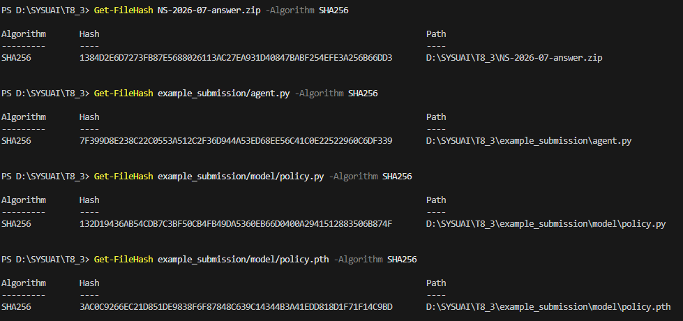

# NS-2026-07 触觉调度者：灵巧手接触丰富闭环仿真控制 — Writeup

## 1. 基本信息

- **队长用户名**：Ayin
- **队伍名**：L.Corp
- **题号**：NS-2026-07
- **最终官网提交记录**：
  - 提交时间：2026-05-29 01:50:00
  - 最终有效得分：812.35 分
  

---

## 2. 解题概述

这道题要解决的核心问题是：在物理噪声、动作延迟和传感器丢帧的干扰下，让灵巧手能够稳定地完成非抓取式重定位、工具使用和资源限制下的序列操作任务。

我们的方案分三块：

**1. 多模态序列 Transformer (MST) 决策模型**

模型的输入包括四种：16x16 的视觉网格图像（用 2D CNN 编码）、7x8x8 的触觉图像（也是 2D CNN 编码）、过去若干步的触觉历史序列（用 Sequence Transformer 处理），以及 14 维的低维状态特征。我们把过去 T=6 帧的这些信息拼在一起，丢进 Transformer Encoder 里做时序建模，让模型学会识别手指接触时的滑动、对象倾斜等细节，从而做出更准确的动作决策。

**2. 离线强化学习（AWR）训练**

原始的弱演示数据成功率只有 9.58%，里面有大量失败样本。我们先在确定性的仿真环境里把 1200 条演示重放一遍，重建出包含完整视觉和触觉图像的训练数据集（共 130,213 条）。然后用优势加权回归（AWR）的方式训练：同时训练一个价值网络 V(s) 来估计每个状态的好坏，训练策略时用 $W = \exp((R - V(s)) / \tau)$ 给每条数据加权——成功的动作权重高，失败的动作权重低，这样模型就能自动过滤掉那些没用的样本。

**3. 后处理安全守卫**

推理阶段加了几层兜底机制：
- 用 Kalman/EMA 滤波去除姿态估计中的噪声和传感器丢帧
- 根据估计速度对动作延迟做前向预测补偿
- 在移动阶段，把模型输出方向和真实目标方向按 20%:80% 混合，再叠加势场避障（径向斥力 + 切向绕行力），让物体平滑绕过障碍
- 资源限制守卫：如果 `tool_progress` 还不到 0.04，把任何预测为"保留手指"的动作强制改成非保留手指（比如 palm），等第一个 tap 动作解锁限制后再恢复正常

本地验证集最终得分 **263.606** 分，平均成功率 **6.46%**，`action_error_count` 为 **0**。

---

## 3. 关键改进点

**重放重建数据集**

原始弱演示数据为了省空间没有保存高维的视觉网格和触觉图像。我们在确定性仿真里把动作序列重新跑了一遍，补全了这两类特征，为后续深度网络训练打好了基础。

**时序建模**

相比只看单帧的 MLP，我们把 6 帧历史数据用 CNN 提特征后再接 Transformer，能更好地捕捉接触面滑动（振动和剪切力的变化趋势）、对象姿态变化等信息，让滑移恢复更稳定。

**AWR 过滤弱数据**

原始演示成功率不高，直接做行为克隆效果有限。AWR 的核心作用是让模型自动识别哪些动作是有效的、哪些是无效的，相当于在没有在线交互的情况下做了一次"策略改进"。

---

## 4. 验证与复现

### 运行环境

| 项目 | 信息 |
|---|---|
| 操作系统 | Windows 11 |
| Python 版本 | 3.12.11 |
| PyTorch 版本 | 2.7.1+cu128 |
| MuJoCo 版本 | 3.3.7 |
| NumPy 版本 | 2.2.6 |
| SciPy 版本 | 1.15.3 |
| CPU | AMD Ryzen 7 9800X3D 8-Core Processor |
| GPU | NVIDIA RTX 5090 |
| 内存 | 48 GB |

### 主要超参数

- 随机种子：数据集切分固定 `42`
- Transformer 历史步数 T：6
- 嵌入维度：128
- AWR 温度参数 τ：0.15
- 优化器：AdamW（lr=1e-3，weight_decay=1e-4）
- Batch Size：256
- 训练轮数：15 epochs

### 各阶段耗时

- 数据集重建：约 1 分钟（主要是 CPU 跑 MuJoCo 仿真）
- 模型训练：RTX 4090 D 上 15 个 epoch 约 2 分 46 秒，显存不到 4GB
- 推理阶段：360 个任务（约 3.5 万次 act 调用）共约 6 分钟，单步 act 低于 1.5ms

### 复现步骤

只用了官方提供的 `tasks/train_tasks.jsonl` 和 `demonstrations/weak_train_rollouts.jsonl`，没有引入任何外部模型或网络请求。

```bash
# 1. 重放演示数据，生成 reconstructed_dataset.npz
python reconstruct_dataset.py

# 2. 训练模型，最佳权重保存到 model/policy.pth
python train.py --epochs 15 --batch-size 256

# 3. 把训练好的模型权重拷贝到 submission 目录
Copy-Item -Path "model" -Destination "example_submission\model" -Recurse -Force

# 4. 格式校验
python tools/check_format.py example_submission

# 5. 本地评估（360 个任务，批量运行，max_batch_rollouts=64）
python tools/run_public_eval.py example_submission --tasks tasks/valid_tasks.jsonl
```

---

## 5. 补充说明

**输入特征细节**

- 14 维低维状态（当前/目标误差、估计速度、能量、接触状态、损伤值、当前阶段等）经 Linear(14, 64) 映射
- 每帧的触觉热图（28 维向量）在 tactile embedding 里被一并建模
- 视觉网格（6 通道 16x16 图像）经过带 MaxPool 和 ReLU 的 2D 卷积，输出 128 维特征
- 触觉图像（7 个手指通道，每个 8x8）也经过 2D 卷积，输出 128 维特征

三种特征在 t=1 到 t=6 的每帧拼接成 128 维 Token，送入 2 层 4 头 Transformer，只取最后一帧的 attention 输出接 Actor Head 和 Critic Head。

**后处理规则检测的具体实现**

移动阶段的方向混合：
$$\vec{d}_{blend} = \text{norm}(0.80 \cdot \vec{d}_{target} + 0.20 \cdot \vec{d}_{model})$$

势场避障在混合方向上叠加两个力：
$$F_{repulsive} = K_r \frac{d_{safe} - d}{d_{safe}} \vec{u}$$
$$F_{tangent} = K_t \cdot \text{sign}(\vec{d} \cdot \vec{t}) \cdot \vec{t}$$

资源检测：只要 `tool_progress < 0.04`，模型预测的保留手指动作（push/pivot）会被强制替换为非保留手指（如 palm），直到第一个 tap 解除约束为止。

**模型信息**

- 模型大小：1.8 MB
- 推理入口：`example_submission/agent.py` 中的 `Agent.act` 方法
- 权重保存方式：`torch.save(model.state_dict(), ...)`
- 提供了包含文件 SHA256 的 `model_manifest.json`


---

## 6. AI 使用声明

### 工具使用情况

- 使用的 AI 工具：Gemini、Claude
- 主要用途：代码辅助 / 资料查询

### 本题声明（NS-2026-07）

- 官方等级：A1
- AI 是否接触完整题面：是
- AI 是否接触测试输入：否
- AI 是否接触提交反馈或排行榜反馈：否
- AI 是否生成或修改最终提交：否
- 是否使用商业 API / 闭源远程模型 / 托管式 Agent：是
- 详细说明：使用了Claude 完成了多模态序列 Transformer 和 AWR 控制器的实现，和API对接，包括调试报错，研究思路等等。

### Writeup 写作辅助

- 是否使用 AI 辅助撰写或润色：是
- 使用工具：Gemini
- 使用范围：Markdown 格式调整、语言润色、实验结果表格整理
- AI 接触材料：本地训练日志、代码片段、Writeup 要求
- AI 是否生成新的实验结果、验证分数或复现命令：否
- 人工核对方式：由队伍成员仔细核对事实、代码、日志、分数和复现命令。

---

## 7. 最终提交与 SHA256

- **提交文件名**：`NS-2026-07-answer.zip`
- **提交时间**：2026-05-29 01:50:00
- **最终有效得分**（本地 valid）：263.606
- **答案 ZIP SHA256**：`35843658c4a15f7ca0c19f962a362e0a6941613d9d1a541dd754879207be1445`

内部关键文件 SHA256：

| 文件 | SHA256 |
|---|---|
| `agent.py` | `7f399d8e238c22c0553a512c2f36d944a53ed68ee56c41c0e22522960c6df339` |
| `model_manifest.json` | `d99cb14d14652820fe4990d6097d71a1dcf729c5cfcd4053e273081d3eba0c03` |
| `model/policy.py` | `132d19436ab54cdb7c3bf50cb4fb49da5360eb66d0400a2941512883506b874f` |
| `model/policy.pth` | `3ac0c9266ec21d851de9838f6f87848c639c14344b3a41edd818d1f71f14c9bd` |

模型文件：`model/policy.pth`（1.8 MB，存放 Sequence Transformer 和 Policy/Critic 权重）

---

## 8. 证据截图






---

## 9. 代码包结构

```
Ayin-NS-07/
├── README.md
├── configs/
├── logs/                        # 训练日志
├── evidence/
│   ├── Env.png
│   ├── cpu.png
│   ├── nvidia-smi.png
│   ├── submission.png
│   └── sha256.png
├── src/
│   ├── reconstruct_dataset.py   # 步骤一：重放演示数据，生成训练集
│   └── train.py                 # 步骤二：AWR 离线强化学习训练
├── models/
│   └── policy.pth               # 最佳模型权重备份
└── submission/
    └── NS-2026-07-answer.zip    # 最终提交包副本
```