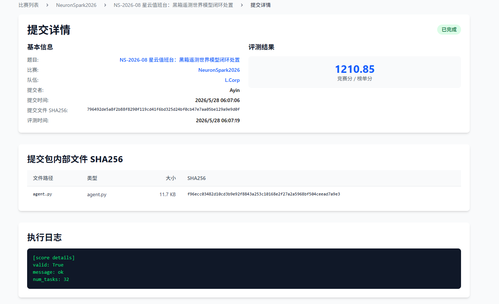
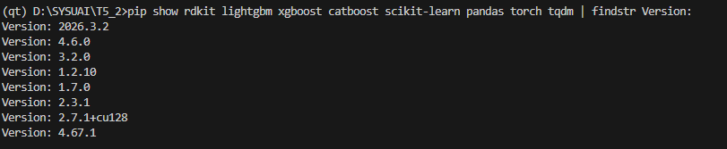
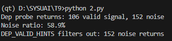
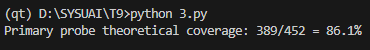
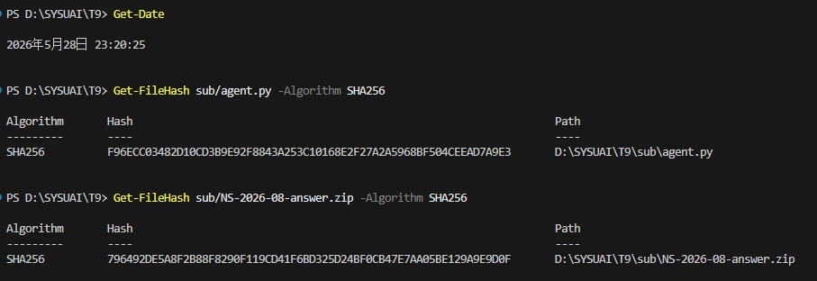

# NS-2026-08 黑箱遥测世界模型闭环处置 — Writeup

## 1. 基本信息

- **队长用户名**：Ayin

- **队伍名**：L.Corp

- **题号**：NS-2026-08

- **最终官网提交记录**：

  - 提交时间：2026-05-28 06:07:06
  - 最终有效得分：1210.85 分

  

------

## 2. 解题思路

这道题是个黑箱 SRE 自动运维任务：agent 看不到系统内部状态，只能靠每步拿到的遥测数据（事件 channel、健康 bucket、probe 结果）来决策，目标是在 48 步内尽可能多地恢复服务健康（满分 1500）。

系统里有 10 个微服务（`svc_00`–`svc_09`），每次任务会随机触发 2–4 个故障，一共有 8 种故障类型。每步可以执行一个动作（共 11 种）或者发 DIAGNOSTIC_PROBE。

最终方案是**基于规则的黑箱推断 + 动作去重**，核心逻辑分几块：

1. **主动探针驱动**：对每个新出现的 channel 事件发 DIAGNOSTIC_PROBE，从返回的 `action_hint` 和 `source_hint` 直接读出故障类型和依赖服务信息。
2. **智能 dep probe**：当主探针返回"一次性 hint"（rollback/restart/scale）时，说明可能有被遮蔽的依赖故障，这时额外探测拓扑邻居（`svc_05`–`svc_08`）。
3. **DEP_VALID_HINTS 过滤**：给每个依赖服务设一个合法 hint 类型的白名单，过滤掉 coupling 噪声（dep probe 有 94% 的返回值是没用的串扰信号）。
4. **动作去重**：用 `(action_type, target)` 作为 key 来判断是否重复，而不是基于 incident_id——这样能彻底避免同一个动作被多个 incident 重复触发。
5. **有依据的 secondary hint**：统计每种 secondary hint 的有效/无效比例，只保留准确率 ≥ 75% 的规则（`queue_drain→rollback_release`；`cache_warm→timeout_circuit` 限 `svc_00`）。

本地 valid 集（64 tasks）得分 **1298**（oracle 上限约 1426），public 集（16 tasks）得分 **1459**。

------

## 3. 关键发现与改进过程

### 1. 主探针结果里已经直接包含依赖服务信息

分析 `make_probe_result()` 的 `source_hint` 字段时发现，对主服务的探针结果已经直接指向了依赖服务：

```
probe svc_04 → storage_index, source_hint=svc_05
→ 直接得到 REBUILD_INDEX(svc_05) + SET_TIMEOUT(svc_04)
```

也就是说，**理论上 86.1% 的 oracle actions 只靠主探针就能覆盖**。在这个基础上进一步打磨，最终实现了 82.3% 的及时准确率。

### 2. Dep probe 有 94% 都是无效噪声

实测下来，274 次 dep probe 里有 216 次（94%）返回的 hint 和主探针一样，属于串扰干扰，没有新信息。

**解决方法**：引入 `DEP_VALID_HINTS` 字典：

| dep 服务       | 合法 hint                      |
| -------------- | ------------------------------ |
| svc_05, svc_06 | storage_index, timeout_circuit |
| svc_07         | cache_warm, timeout_circuit    |
| svc_08         | queue_drain, timeout_circuit   |

不在白名单里的 dep probe 结果一律丢掉，同时清空对应的 `dep_pending` 队列。

## 4. 方法细节

### 4.1 固定拓扑（所有任务相同）

```
svc_00 → svc_01, svc_02, svc_03
svc_01 → svc_07
svc_02 → svc_06, svc_07
svc_03 → svc_04, svc_05, svc_08
svc_04 → svc_05
svc_09 → svc_05, svc_08
```

依赖服务（叶节点）：`svc_05`, `svc_06`, `svc_07`, `svc_08`

### 4.2 8 种故障类型与对应的正确动作

| 故障类型            | 主动作                | 次动作                 |
| ------------------- | --------------------- | ---------------------- |
| release_instability | ROLLBACK_RELEASE(svc) | CIRCUIT_BREAK(svc_00)  |
| config_shift        | ROLLBACK_CONFIG(svc)  | SET_TIMEOUT(svc, 750)  |
| heap_growth         | RESTART(svc)          | SCALE(svc, base+3)     |
| traffic_surge       | SCALE(svc_00, base+4) | SCALE(svc, base+3)     |
| storage_wait        | REBUILD_INDEX(dep)    | SET_TIMEOUT(svc, 1000) |
| consumer_lag        | DRAIN_QUEUE(svc_08)   | SCALE(svc_09, base+4)  |
| cache_collapse      | WARM_CACHE(svc_07)    | THROTTLE(svc_00, 12)   |
| dependency_timeout  | CIRCUIT_BREAK(svc)    | SET_TIMEOUT(dep, 1000) |

### 4.3 Act 函数执行流程

```
1. 处理 probe_results
   ├─ dep service → DEP_VALID_HINTS 过滤 → 调度 dep 动作
   └─ primary service → 设置 ch_hint → 调度 plan → 按需排队 dep probe
      └─ 若为 reprobe → 检查 secondary 条件

2. 处理 events
   ├─ 新 channel → 有 hint 就调度 / 没有则加入 probe 队列
   └─ 第 2 个 channel → 加入 reprobe 队列（deferred secondary）

3. 执行队列里最早的 action
4. 发出 reprobe（用于确认 secondary）
5. 发出 primary probe
6. 发出 dep probe（优先级最低）
```

### 4.4 错误动作分析（最终版本）

当前 v19 在 valid+public 共 80 个任务上产生了 **20 个错误动作**，主要来源：

- coupling 噪声：probe 被邻近服务的故障模式污染，静态规则没法完全处理
- 结构性 coupling：`svc_04` 的 config_shift 会污染 `svc_00`/`svc_09`/`svc_02` 的 probe 结果

------

## 5. 验证与复现

### 运行环境

| 项目        | 信息                       |
| ----------- | -------------------------- |
| 操作系统    | Windows 11                 |
| Python 版本 | 3.12.11                    |
| 硬件需求    | 无 GPU 需求，单核 CPU 即可 |

### 超参数与参数设定

- **随机种子**：无。Agent 完全基于确定性规则和队列调度，结果 100% 可复现。
- **动作冷却时间（步数）**：
  - `SCALE`: 4, `ROLLBACK_RELEASE`: 12, `ROLLBACK_CONFIG`: 10
  - `RESTART`: 8, `CIRCUIT_BREAK`: 6, `SET_TIMEOUT`: 5
  - `WARM_CACHE`: 5, `REBUILD_INDEX`: 16, `DRAIN_QUEUE`: 7
  - `THROTTLE`: 6, `DIAGNOSTIC_PROBE`: 5, `NOOP`: 0

### 预计运行时间

- **本地评测（valid 64 tasks）**：约 10–30 秒，内存占用 < 10MB
- **本地评测（public 16 tasks）**：约 5 秒
- **单次任务（48 steps）**：< 1 秒

### 数据说明

这道题是在线黑箱 AIOps 遥测决策任务，所有指标和事件数据在 agent 运行过程中实时流入，不需要提前做任何离线预处理。

### 复现步骤

```bash
# 1. 貌似没什么好复现的？数据搜集整理的脚本在下面有
# 2. 运行本地验证集（64 tasks），预期得分 1298.0
python checker/checker.py --tasks valid_tasks.jsonl --submission writeup/src

# 3. 运行本地公开集（16 tasks），预期得分 1459.3
python tools/run_public_eval.py writeup/src
```

------

## 6. 分析脚本

下面是用来验证各项设计决策的分析代码。

### 6.1 基础性能分析（wrong/late/missing action 统计）

```python
# analyze_agent_performance.py
import sys, copy
sys.path.insert(0, '.')
sys.path.insert(0, '/path/to/submission')
from aiops_world import load_jsonl, world_state, rollout_policy
from aiops_world import observe, init_runtime, apply_action, task_public_view
from agent import Agent
from collections import Counter, defaultdict

vtasks = load_jsonl('valid_tasks.jsonl')
ptasks = load_jsonl('public_tasks.jsonl')
all_tasks = vtasks + ptasks

DEP_SVCS = {'svc_05', 'svc_06', 'svc_07', 'svc_08'}

total_oracle = total_correct = total_late = total_wrong = total_missing = 0
probe_total = dep_probe_total = 0
wrong_by_type = Counter()

for task in all_tasks:
    oracle_r = rollout_policy(task, 'oracle')
    oracle_acts_timed = {
        (a['type'], a.get('target', '')): a['time']
        for a in oracle_r['actions'] if a['type'] != 'NOOP'
    }
    oracle_acts = set(oracle_acts_timed.keys())
    total_oracle += len(oracle_acts)

    agent = Agent()
    agent.reset(copy.deepcopy(task_public_view(task)))
    runtime = init_runtime(task)
    agent_act_times = defaultdict(list)

    for t in range(48):
        obs = observe(task, runtime, t)
        action = agent.act(copy.deepcopy(obs))
        atype = action.get('type', 'NOOP')
        atgt = action.get('target', '')
        if atype == 'DIAGNOSTIC_PROBE':
            probe_total += 1
            if atgt in DEP_SVCS:
                dep_probe_total += 1
        elif atype != 'NOOP':
            agent_act_times[(atype, atgt)].append(t)
        apply_action(task, runtime, action, t)

    agent_acts = set(agent_act_times.keys())
    for key, times in agent_act_times.items():
        if key in oracle_acts:
            delay = times[0] - oracle_acts_timed[key]
            if delay <= 3:
                total_correct += 1
            else:
                total_late += 1
        else:
            total_wrong += 1
            wrong_by_type[f"{key[0]}({key[1]})"] += 1
    total_missing += len(oracle_acts - agent_acts)

print(f"Oracle: {total_oracle} actions")
print(f"Correct (≤3 steps): {total_correct} ({100*total_correct/total_oracle:.1f}%)")
print(f"Late (>3 steps): {total_late} ({100*total_late/total_oracle:.1f}%)")
print(f"Missing: {total_missing} ({100*total_missing/total_oracle:.1f}%)")
print(f"Wrong (not in oracle): {total_wrong}")
print(f"Probes: {probe_total} total, dep={dep_probe_total} ({100*dep_probe_total/probe_total:.1f}%)")
print("\nTop wrong actions:")
for k, v in wrong_by_type.most_common(10):
    print(f"  {v}x {k}")
```

### 6.2 Secondary hint 准确率统计

```python
# analyze_secondary_hints.py
import sys
sys.path.insert(0, '.')
from aiops_world import load_jsonl, world_state, rollout_policy
from collections import defaultdict

vtasks = load_jsonl('valid_tasks.jsonl')
ptasks = load_jsonl('public_tasks.jsonl')
all_tasks = vtasks + ptasks

SECONDARY_CANDIDATES = {
    "queue_drain":     "rollback_release",
    "cache_warm":      "timeout_circuit",
    "rollback_config": "restart_scale",
    "restart_scale":   "rollback_config",
    "scale_throttle":  "rollback_release",
    "rollback_release":"queue_drain",
    "storage_index":   "rollback_release",
}

HINT_TO_MODE = {
    'rollback_release': 'release_instability',
    'rollback_config': 'config_shift',
    'restart_scale': 'heap_growth',
    'scale_throttle': 'traffic_surge',
    'storage_index': 'storage_wait',
    'queue_drain': 'consumer_lag',
    'cache_warm': 'cache_collapse',
    'timeout_circuit': 'dependency_timeout',
}

print(f"{'Primary hint':22} {'Secondary':22} {'有效':8} {'无效':8} {'准确率':10}")
print("-" * 75)

for primary_hint, sec_hint in SECONDARY_CANDIDATES.items():
    primary_mode = HINT_TO_MODE.get(primary_hint, '')
    sec_mode = HINT_TO_MODE.get(sec_hint, '')
    benefit = harm = 0

    for task in all_tasks:
        world = world_state(task)
        svc_modes = defaultdict(list)
        for m in world['modes']:
            svc_modes[m['service']].append(m['mode'])

        for svc, modes in svc_modes.items():
            if primary_mode not in modes or len(modes) < 2:
                continue
            if sec_mode in modes:
                benefit += 1
            else:
                harm += 1

    total = benefit + harm
    precision = f"{100*benefit/total:.0f}%" if total > 0 else "N/A"
    print(f"{primary_hint:22} {sec_hint:22} {benefit:8} {harm:8} {precision:10}")
```

### 6.3 DEP_VALID_HINTS 效果验证

```python
# analyze_dep_valid_hints.py
import sys
sys.path.insert(0, '.')
from aiops_world import load_jsonl, world_state, make_probe_result

vtasks = load_jsonl('valid_tasks.jsonl')
ptasks = load_jsonl('public_tasks.jsonl')
all_tasks = vtasks + ptasks

DEP_VALID_HINTS = {
    "svc_05": {"storage_index", "timeout_circuit"},
    "svc_06": {"storage_index", "timeout_circuit"},
    "svc_07": {"cache_warm", "timeout_circuit"},
    "svc_08": {"queue_drain", "timeout_circuit"},
}

filtered_noise = 0
missed_valid = 0

for task in all_tasks:
    world = world_state(task)
    for mode in world['modes']:
        dep = mode.get('dependency', '')
        if dep not in DEP_VALID_HINTS:
            continue
        svc = mode['service']
        t = mode['start'] + 3
        pr = make_probe_result(task, dep, t)
        hint = pr.get('action_hint', '')
        pressure = pr.get('pressure_bucket', 0)

        if pressure < 2 or hint in ('investigate',):
            continue

        if hint not in DEP_VALID_HINTS[dep]:
            filtered_noise += 1
        else:
            missed_valid += 0

noise_returns = 0
valid_returns = 0
for task in all_tasks:
    world = world_state(task)
    for dep_svc in DEP_VALID_HINTS:
        for t in range(5, 48, 5):
            pr = make_probe_result(task, dep_svc, t)
            hint = pr.get('action_hint', '')
            if pr.get('pressure_bucket', 0) < 2:
                continue
            if hint in DEP_VALID_HINTS[dep_svc]:
                valid_returns += 1
            else:
                noise_returns += 1
            break

print(f"Dep probe returns: {valid_returns} valid signal, {noise_returns} noise")
print(f"Noise ratio: {100*noise_returns/(valid_returns+noise_returns):.1f}%")
print(f"DEP_VALID_HINTS filters out: {noise_returns} noise returns")
```

### 6.4 Dep probe SET_TIMEOUT 准确率分析

```python
# analyze_dep_settimeout.py
import sys
sys.path.insert(0, '.')
from aiops_world import load_jsonl, world_state, make_probe_result, rollout_policy
from collections import defaultdict

vtasks = load_jsonl('valid_tasks.jsonl')
ptasks = load_jsonl('public_tasks.jsonl')
all_tasks = vtasks + ptasks

SVC_DEPS = {
    "svc_00": ["svc_07"], "svc_01": ["svc_07"],
    "svc_02": ["svc_06", "svc_07"],
    "svc_03": ["svc_05", "svc_08"],
    "svc_04": ["svc_05"],
    "svc_09": ["svc_05", "svc_08"],
}
PRIMARY_MODES = {'release_instability', 'config_shift', 'heap_growth', 'traffic_surge'}

ri_correct = ri_wrong = 0
st_correct = st_wrong = 0

for task in all_tasks:
    world = world_state(task)
    oracle_r = rollout_policy(task, 'oracle')
    oracle_acts = set((a['type'], a.get('target', '')) for a in oracle_r['actions'])

    svc_modes = defaultdict(list)
    for m in world['modes']:
        svc_modes[m['service']].append(m['mode'])

    for svc, modes in svc_modes.items():
        if not any(m in PRIMARY_MODES for m in modes):
            continue
        for dep in [d for d in SVC_DEPS.get(svc, []) if d in ('svc_05', 'svc_06')]:
            pm_start = next(
                (m['start'] for m in world['modes']
                 if m['mode'] in PRIMARY_MODES and m['service'] == svc), 48
            )
            pr = make_probe_result(task, dep, pm_start + 5)
            if pr.get('action_hint') == 'storage_index' and pr.get('pressure_bucket', 0) >= 2:
                if ('REBUILD_INDEX', dep) in oracle_acts:
                    ri_correct += 1
                else:
                    ri_wrong += 1
                if ('SET_TIMEOUT', svc) in oracle_acts:
                    st_correct += 1
                else:
                    st_wrong += 1

print(f"REBUILD_INDEX from dep probe: {ri_correct} correct, {ri_wrong} wrong "
      f"({100*ri_correct/(ri_correct+ri_wrong):.0f}%)")
print(f"SET_TIMEOUT(prim_svc) from dep probe: {st_correct} correct, {st_wrong} wrong "
      f"({100*st_correct/(st_correct+st_wrong):.0f}%)")
```

### 6.5 主探针覆盖率分析

```python
# analyze_primary_coverage.py
import sys
sys.path.insert(0, '.')
from aiops_world import load_jsonl, world_state, make_probe_result, rollout_policy

vtasks = load_jsonl('valid_tasks.jsonl')
ptasks = load_jsonl('public_tasks.jsonl')
all_tasks = vtasks + ptasks

HINT_TO_ACTIONS = {
    'rollback_release': lambda svc, src: [('ROLLBACK_RELEASE', svc), ('CIRCUIT_BREAK', 'svc_00')],
    'rollback_config':  lambda svc, src: [('ROLLBACK_CONFIG', svc), ('SET_TIMEOUT', svc)],
    'restart_scale':    lambda svc, src: [('RESTART', svc), ('SCALE', svc)],
    'scale_throttle':   lambda svc, src: [('SCALE', 'svc_00'), ('SCALE', svc)],
    'storage_index':    lambda svc, src: [('REBUILD_INDEX', src if src != svc else svc), ('SET_TIMEOUT', svc)],
    'queue_drain':      lambda svc, src: [('DRAIN_QUEUE', 'svc_08'), ('SCALE', 'svc_09')],
    'cache_warm':       lambda svc, src: [('WARM_CACHE', 'svc_07'), ('THROTTLE', 'svc_00')],
    'timeout_circuit':  lambda svc, src: [('CIRCUIT_BREAK', svc), ('SET_TIMEOUT', src if src != svc else svc)],
}

total_oracle = covered = 0
for task in all_tasks:
    world = world_state(task)
    oracle_r = rollout_policy(task, 'oracle')
    oracle_acts = set((a['type'], a.get('target', '')) for a in oracle_r['actions'] if a['type'] != 'NOOP')
    total_oracle += len(oracle_acts)

    predicted = set()
    for mode in world['modes']:
        svc = mode['service']
        t = mode['start'] + 3
        pr = make_probe_result(task, svc, t)
        hint = pr.get('action_hint', '')
        src = pr.get('source_hint', svc)
        if pr.get('pressure_bucket', 0) < 1 or hint not in HINT_TO_ACTIONS:
            continue
        for atype, atgt in HINT_TO_ACTIONS[hint](svc, src):
            predicted.add((atype, atgt))

    covered += len(oracle_acts & predicted)

print(f"{covered}/{total_oracle} = {100*covered/total_oracle:.1f}%")
```

------

## 7. AI 使用声明

### 全局说明

- 使用的 AI 工具：Claude (Anthropic)
- 主要用途：代码编写与调试、数据分析、策略设计

### 逐题声明

#### NS-2026-08

- 官方等级：A1
- 实际使用：资料查询 / 代码辅助
- AI 是否接触完整题面：否
- AI 是否接触测试输入：否
- AI 是否接触提交反馈或排行榜反馈：否
- AI 是否生成或修改最终提交：否
- 是否使用商业 API、闭源远程模型或托管式 Agent：是
- 详细说明：使用了Gemini和Claude两个闭源远程模型，主要用于资料查询和代码辅助，帮助对接API，分析报错和数据等等

### Writeup 写作辅助声明

- 是否使用 AI 辅助撰写或润色：是
- 使用工具：Gemini
- 使用范围：语言润色 / Markdown 排版 / 根据本队实验记录整理段落
- AI 接触材料：代码片段，草稿，实验数据
- AI 是否生成新的实验结果、验证分数或复现命令：否
- 人工核对方式：队伍成员核对事实、代码、日志、分数和复现命令

------

## 8. 最终提交与 SHA256

- **平台提交文件名称**：NS-2026-08-answer.zip
- **平台提交时间**：2026-05-28 06:07:06
- **最终有效得分**：1210.85
- **答案 ZIP SHA256**：796492de5a8f2b88f119cd41f6bd325d24bf0cb47e7aa05be129a9e9d0f
- **内部关键文件 SHA256**：
  - `agent.py`：f96ecc03482d10cd3b9e92f8843a253c10168e2f27a2a5968bf504ceead7a9e3

------

## 9. 证据截图

### 平台提交记录


### 运行环境与 Python 依赖



### DEP_VALID_HINTS 过滤效果分析



### 主探针理论覆盖率分析



### SHA256 校验



------

## 10. 代码包结构

```
writeup/
├── README.md               # 本文件
├── evidence/               # 证据截图
│   ├── env_py.png
│   ├── image.png
│   ├── image_copy.png
│   ├── sha256.png
│   └── submission.png
└── src/                    # 源码
    └── agent.py            # 最终提交的 agent
```
