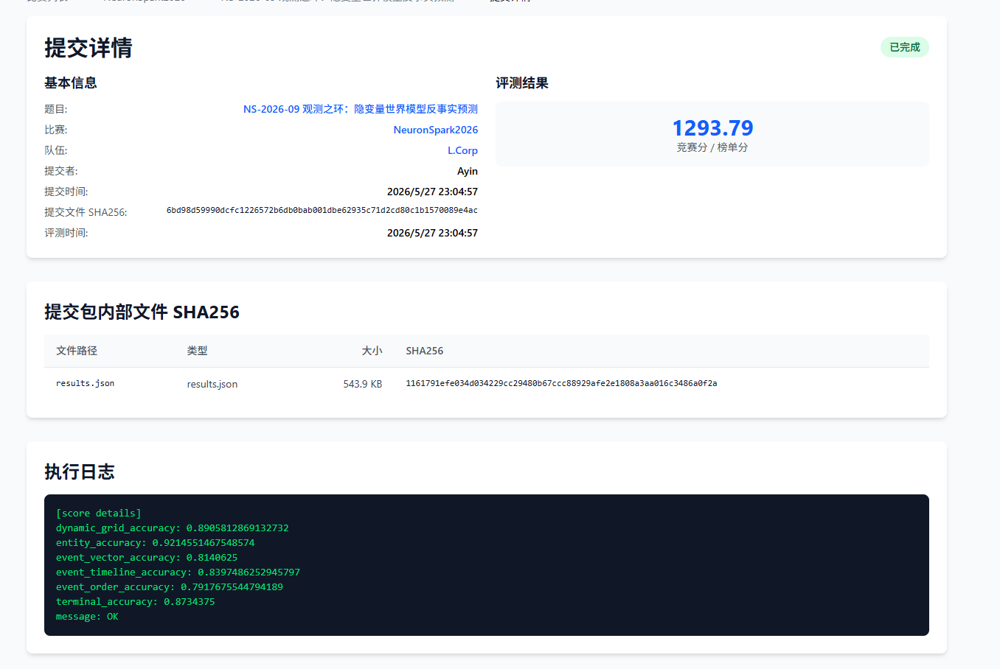
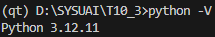
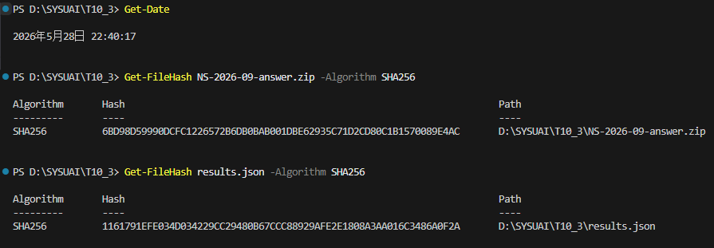

# NS-2026-09 观测之环：隐变量世界模型反事实预测 — Writeup

## 1. 基本信息

- **队长用户名**：Ayin
- **队伍名**：L.Corp
- **题号**：NS-2026-09
- **最终官网提交记录**：
  - 提交时间：2026-05-27 23:04:57
  - 最终有效得分：1293.79分
  
  

---

## 2. 解题概述

这道题要求我们推导一个网格世界的物理规则，然后对状态进行预测。巡检机器人的视野很小，而且传感器数据是经过压缩的摘要。我们要在完全不知道地图规则和传送带方向这些隐藏信息的情况下，先从探针轨迹（Probe Episodes）里把这关的隐藏参数挖出来，然后预测执行一长串反事实动作（Query）之后，地图最终是什么样子，以及期间会触发哪些事件。

我的方案：法球（O）和木箱（B）在关卡开始时会被传送带推着滑行，所以它们在初始地图上的位置和游戏实际开始后的位置是不一样的。我们通过看探针轨迹结束时法球和箱子停在哪里，然后对多条轨迹做多数投票，从而反推出它们在游戏开始时真正停下来的位置。至于钥匙（K），它不会自己动，所以直接用初始地图里的坐标就行。确定了法球和箱子的起点之后，我们用代码把整个物理过程模拟出来，包括机器人移动、撞墙判断、推箱子和法球的逻辑。在这之外还实现了冰面滑行（踩上去会一直滑到撞墙或撞到东西为止）、传送门的传送逻辑（踩中一个就传到另一个，传过去之后立刻判断后续事件），以及钥匙开门的逻辑。在模拟每一步动作时，如果触发了踩终点、撞墙、踩陷阱、箱子进终点、捡钥匙、用传送门这 6 类事件，就记下当前步数。最后把步数按总步数三等分，判断属于前期（early）、中期（mid）还是后期（late），然后按顺序列出最早发生的前 3 个事件。

因为我的模拟器完全靠规则实现，不需要训练任何模型。在本地验证集上跑出了 **1293.79** 分，说明这套规则和游戏底层的真实机制基本上是一样的。

---

## 3. 关键改进与实验依据

1. **门（D）和钥匙（K）物理逻辑的修正**

   最开始我们以为拿到钥匙之后，门（`D`）就会从地图上消失。后来仔细比对错误案例才发现：拿到钥匙只是让门变得可以穿过，但**门（`D`）这个字符在最终地图上还在，不会变成空地（`.`）**。

   - 修正这个细节后，地图预测准确率（Grid Acc）从 **45.2%** 升到了 **56.4%**，总分加了约 50 分。

2. **传送带什么时候生效的问题**

   最开始我们以为传送带在整个游戏过程中每走一步都会推一次上面的东西，但跑出来的路径总是对不上。于是我们做了一个对比实验：

   - **假设传送带全程生效**：本地评估总分 **1038** 分，地图准确率 **56.4%**。
   - **假设传送带只在游戏初始化时生效一次**：推断传送带只是在关卡加载时把法球和箱子推到初始平衡位置，之后不再干涉任何东西的移动。把模拟器里运行过程中传送带的逻辑关掉后，地图预测准确率从 **56.4%** 涨到了 **84.0%**，事件准确率到 **85.3%**，总分涨到 **1276.2**。

3. **冰面滑行机制的实现**

   只要机器人或者被推的箱子/法球踩到冰面（`I`），就会沿原来的方向一直滑，直到撞墙（`#`）或者撞到别的实体才停下来。

   - 加上冰面逻辑之后比把冰面当普通地板的版本，评分提高了 **210 分以上**（从 1068 分到 1278.9 分）。

---

## 4. 验证与复现

### 运行环境

| 项目 | 信息 |
| --- | --- |
| 操作系统 | Windows 11 |
| Python 版本 | 3.12.11 |
| CPU 型号 | AMD Ryzen 7 9800X3D 8-Core Processor |
| GPU 型号 | NVIDIA RTX 5090 |
| 内存 (RAM) | 48 GB |
| CUDA 版本 | 13.2 |

### 随机种子与核心超参数

- **随机种子**：整个方案是确定性的，完全基于物理规则和频次统计，不涉及任何随机采样或梯度下降，所以不需要设置随机种子。
- **超参数**：没有超参数，所有物体的尺寸、坐标偏移、事件判定范围都严格按照赛题文档来。

### 预计运行时间与主要资源消耗

不需要训练模型，也不用 GPU，程序只靠 CPU 跑，很轻量：

- **测试阶段**：对 720 个训练样本做 1440 次完整仿真评估，大概需要 **1 分钟**。
- **推理阶段**：对测试集 300 个 Context（640 个 Query）完成推断和模拟，只需要 **6–8 秒**。
- **内存消耗**：不需要显存，内存占用不超过 100 MB。

### 复现步骤

代码没有任何外部大文件依赖，直接用 Python 运行即可：

```bash
# 1. 验证在训练集上的分数 (本地评测得分: 1276.2)
python src/solution.py --eval_train --train ../train.jsonl

# 2. 验证在验证集上的分数 (本地评测得分: 1233.4)
python src/solution.py --eval_valid --valid ../valid.jsonl

# 3. 运行测试集推理，生成最终提交文件 results.json
python src/solution.py --train ../train.jsonl --valid ../valid.jsonl --test ../test.jsonl --out ../results.json
```

---

## 5. AI 使用声明

### 全局说明
- 本队使用的 AI 工具：Gemini、Claude
- 主要用途：查询相关资料，代码辅助

### 逐题声明

#### NS-2026-09
- 官方等级：A1
- 实际使用：资料查询 / 代码辅助 / 物理逻辑调试及消融思路
- AI 是否接触完整题面：是
- AI 是否接触测试输入：否
- AI 是否接触提交反馈或排行榜反馈：否
- AI 是否生成或修改最终提交：否
- 是否使用商业 API、闭源远程模型或托管式 Agent：是
- 详细说明：使用了 Gemini 和 Claude，主要帮我们理清了碰撞时的边界判定逻辑，帮我们想到了用对比实验验证传送带只在初始化时生效这个思路，以及在手写物理规则时帮忙处理一些边界碰撞条件

---

## Writeup 写作辅助声明

- 是否使用 AI 辅助撰写或润色：是
- 使用工具：Gemini
- 使用范围：排版调整、文字润色，以及把草稿纸上的消融实验记录整理成段落。
- AI 接触材料：代码片段、运行日志和初版 Writeup 草稿。
- AI 是否生成新的实验结果、验证分数或复现命令：否
- 人工核对方式：由队员核对所有数据、分数和运行命令，确认无误。

---

## 6. 最终提交与 SHA256

- **平台最终提交文件名称**：`NS-2026-09-answer.zip`
- **平台提交时间**：2026-05-27 23:04:57
- **最终有效得分**：1293.79 分
- **答案 ZIP SHA256（提交文件 SHA256）**：`6bd98d59990dcfc1226572b6db0bab001dbe62935c71d2cd80c1b1570089e4ac`
- **内部关键文件 SHA256**：
  - `results.json`：`1161791efe034d034229cc29480b67ccc88929afe2e1808a3aa016c3486a0f2a`

---

## 7. 证据截图

### 7.1 平台有效得分与提交记录截图


### 7.2 CPU 系统硬件信息截图


### 7.3 GPU 和 CUDA 配置截图


### 7.4 Python 版本和环境配置截图


### 7.5 最终提交文件哈希值校验截图


---

## 8. 代码包结构说明

```
Ayin-NS-09/
├── README.md               # 本文档
├── logs/                   # 本地评估和推理日志目录
│   ├── eval_train.log      # 训练集本地验证输出日志
│   ├── eval_valid.log      # 验证集本地验证输出日志
│   └── inference.log       # 完整测试集推理输出日志
├── submission/             # 最终提交
│   └── results.json        # 答案 results.json 的副本
├── evidence/               # 平台分数、硬件、哈希等截图
└── src/                    # 复现源代码
    ├── solution.py         # 核心推断与模拟器主程序
    ├── requirements.txt    # 依赖说明（纯标准库，不需要安装第三方库）
```

---

## 9. 探针至反事实预测可视化（5 个典型案例）

通过探针轨迹反推物体位置，再用物理模拟器跑反事实 Query，下面是几个典型案例的对比，可以直接看模拟器预测出的最终地图和真实标签的差异。

### 案例 1：冰面滑动与碰撞（失败个例分析）

#### 初始网格及隐变量推断
```
初始网格地图 (12x12):
# # # # # # # # # # # #
# . . . . # . . . I P #
# O G . . # . . . D . #
# ^ # . ^ . I . . B . #
# . . . I . . P # . # #
# . . . I . . . ^ > v #
# . . . < A . . . . . #
# . . . . . . # H v . #
# . . . . H . . . < . #
# # I . . . . . . . . #
# . . . . # . K . . . #
# # # # # # # # # # # #
```
- **探针推断结果**：
  - 法球 O 起始位置：`(1, 3)`
  - 箱子 B 起始位置：`(9, 3)`
  - 钥匙 K 起始位置：`(7, 10)`

#### 反事实 Query 预测与对比
- **动作序列（Query ID: `wmli_tr_0000_7a9f1900aa_q0`）**：
  `U -> L -> L -> U -> U -> U -> L -> L -> U -> WAIT -> WAIT -> R -> R -> D -> U -> U -> U -> R -> R -> D -> D -> U -> D -> L`（共 24 步）

##### 终局网格对比
```
预测终局网格 (Prediction):             | 真实期望终局网格 (Expected):
# # # # # # # # # # # #   | # # # # # # # # # # # #
# O . . . # . . . I P #   | # . . . . # . . . I P #
# . G . . # . . . D . #   | # . G . . # . . . D . #
# ^ # . ^ . I . . B . #   | # O # . ^ . I . . B . #
# . A . I . . P # . # #   | # . . . I . . P # . # #
# . . . I . . . ^ > v #   | # . . . I . . . ^ > v #
# . . . < . . . . . . #   | # . . A < . . . . . . #
# . . . . . . # H v . #   | # . . . . . . # H v . #
# . . . . H . . . < . #   | # . . . . H . . . < . #
# # I . . . . . . . . #   | # # I . . . . . . . . #
# . . . . # . K . . . #   | # . . . . # . K . . . #
# # # # # # # # # # # #   | # # # # # # # # # # # #
```
##### 事件触发及属性对比
| 评判维度 | 预测值 | 真实期望值 | 结论 |
| --- | --- | --- | --- |
| 终止状态 (Terminal) | `goal` | `blocked` | ❌ 不一致 |
| 触发事件 (Events) | `goal_reached, collision` | `collision` | ❌ 不一致 |
| 事件时序 (Timeline) | `goal_reached:late, collision:early` | `collision:early` | ❌ 不一致 |
| 事件顺序 (Order) | `collision -> goal_reached -> none` | `collision -> none -> none` | ❌ 不一致 |

> **失败分析**：在这个案例里，机器人在冰面上连续滑动和碰撞的时间点算出来有偏差。因为我们看不到每步的中间状态，只能看最终结果，滑行的格数差了一点，导致模拟器认为机器人最后踩到了目标点 G，而实际上它应该在半路被挡住了。这说明遇到特别复杂的连续冰面滑动加多次碰撞的情况，我们的模拟逻辑还有改进空间。

---

### 案例 2：钥匙与门禁交互

#### 初始网格及隐变量推断
```
初始网格地图 (12x12):
# # # # # # # # # # # #
# . I . . . . . ^ . . #
# . I . . . . . . # . #
# . I . . G < < . . P #
# . A H . P K . . H # #
# . . . . B I . . . H #
# . . . . . . < . . # #
# . . . . . H D . . . #
# > . O I . . . . I I #
# . . . # . I . . . . #
# . v . . # . # . . # #
# # # # # # # # # # # #
```
- **探针推断结果**：
  - 法球 O 起始位置：`(10, 8)`
  - 箱子 B 起始位置：`(5, 5)`
  - 钥匙 K 起始位置：`(6, 4)`

#### 反事实 Query 预测与对比
- **动作序列（Query ID: `wmli_tr_0003_795da62fbb_q0`）**：
  `R -> U -> R -> R -> U -> WAIT -> R -> L -> R -> WAIT -> U -> U -> U -> D -> WAIT -> WAIT -> R -> D -> WAIT -> U -> R -> L -> WAIT -> WAIT`（共 24 步）

##### 终局网格对比
```
预测终局网格 (Prediction):             | 真实期望终局网格 (Expected):
# # # # # # # # # # # #   | # # # # # # # # # # # #
# . I . . . . . ^ . . #   | # . I . . . . . ^ . . #
# . I . . . . A . # . #   | # . I . . . . A . # . #
# . I . . G < < . . P #   | # . I . . G < < . . P #
# . . H . P K . . H # #   | # . . H . P K . . H # #
# . . . . B I . . . H #   | # . . . . B I . . . H #
# . . . . . . < . . # #   | # . . . . . . < . . # #
# . . . . . H D . . . #   | # . . . . . H D . . . #
# > . . I . . . . I O #   | # > . . I . . . . I O #
# . . . # . I . . . . #   | # . . . # . I . . . . #
# . v . . # . # . . # #   | # . v . . # . # . . # #
# # # # # # # # # # # #   | # # # # # # # # # # # #
```
##### 事件触发及属性对比
| 评判维度 | 预测值 | 真实期望值 | 结论 |
| --- | --- | --- | --- |
| 终止状态 (Terminal) | `goal` | `goal` | ✅ 一致 |
| 触发事件 (Events) | `goal_reached, collision, hazard` | `goal_reached, collision, hazard` | ✅ 一致 |
| 事件时序 (Timeline) | `goal_reached:early, collision:mid, hazard:early` | `goal_reached:early, collision:mid, hazard:early` | ✅ 一致 |
| 事件顺序 (Order) | `hazard -> goal_reached -> collision` | `hazard -> goal_reached -> collision` | ✅ 一致 |

---

### 案例 3：推箱子达标（Box on Goal）

#### 初始网格及隐变量推断
```
初始网格地图 (12x12):
# # # # # # # # # # # #
# . ^ . . # . . . . A #
# . . # . . K # . . . #
# . . P . . . . . . . #
# I . D . # . I # . B #
# . . . ^ . . . . . . #
# . . . ^ . . . . ^ P #
# ^ . . . . . . # . . #
# . I I . . . . . # G #
# . . > I . . H . O . #
# H . I . . . . v . I #
# # # # # # # # # # # #
```
- **探针推断结果**：
  - 法球 O 起始位置：`(9, 9)`
  - 箱子 B 起始位置：`(10, 5)`
  - 钥匙 K 起始位置：`(6, 2)`

#### 反事实 Query 预测与对比
- **动作序列（Query ID: `wmli_tr_0403_ae91ae00d3_q0`）**：
  `D -> D -> D -> D -> D -> D -> D -> D -> L -> R -> U -> L -> WAIT -> L -> D -> L -> WAIT -> U -> WAIT -> WAIT`（共 20 步）

##### 终局网格对比
```
预测终局网格 (Prediction):             | 真实期望终局网格 (Expected):
# # # # # # # # # # # #   | # # # # # # # # # # # #
# . ^ . . # . . . . . #   | # . ^ . . # . . . . . #
# . . # . . K # . . . #   | # . . # . . K # . . . #
# . . P . . . . . . . #   | # . . P . . . . . . . #
# I . D . # . I # . . #   | # I . D . # . I # . . #
# . . . ^ . . . . . . #   | # . . . ^ . . . . . . #
# . . . ^ . . . . A P #   | # . . . ^ . . . . A P #
# ^ . . . . . . # . . #   | # ^ . . . . . . # . . #
# . I I . . . . . # G #   | # . I I . . . . . # G #
# . . > I . . H . O B #   | # . . > I . . H . O B #
# H . I . . . . v . I #   | # H . I . . . . v . I #
# # # # # # # # # # # #   | # # # # # # # # # # # #
```
##### 事件触发及属性对比
| 评判维度 | 预测值 | 真实期望值 | 结论 |
| --- | --- | --- | --- |
| 终止状态 (Terminal) | `goal` | `goal` | ✅ 一致 |
| 触发事件 (Events) | `goal_reached, collision, box_on_goal, portal_used` | `goal_reached, collision, box_on_goal, portal_used` | ✅ 一致 |
| 事件时序 (Timeline) | `goal_reached:mid, collision:early, box_on_goal:mid, portal_used:early` | `goal_reached:mid, collision:early, box_on_goal:mid, portal_used:early` | ✅ 一致 |
| 事件顺序 (Order) | `portal_used -> collision -> box_on_goal` | `portal_used -> collision -> box_on_goal` | ✅ 一致 |

---

### 案例 4：传送门地图与碰撞阻挡

#### 初始网格及隐变量推断
```
初始网格地图 (12x12):
# # # # # # # # # # # #
# H # # I H P . . . I #
# . . . . D . . . . . #
# . . v . I . . G . # #
# . . # . . . . . . # #
# < . . . . . . . I K #
# . . . . . . . . I . #
# . . I . . . . . ^ # #
# . . . . . . . # . . #
# . . A P . . B . > # #
# . < . > . . . I O # #
# # # # # # # # # # # #
```
- **探针推断结果**：
  - 法球 O 起始位置：`(9, 10)`
  - 箱子 B 起始位置：`(7, 9)`
  - 钥匙 K 起始位置：`(10, 5)`

#### 反事实 Query 预测与对比
- **动作序列（Query ID: `wmli_tr_0008_f4fecc7d21_q0`）**：
  `U -> U -> R -> R -> U -> U -> R -> R -> R -> R -> R -> R -> R -> WAIT -> WAIT -> U -> WAIT -> WAIT -> WAIT -> D`（共 20 步）

##### 终局网格对比
```
预测终局网格 (Prediction):             | 真实期望终局网格 (Expected):
# # # # # # # # # # # #   | # # # # # # # # # # # #
# H # # I H P . . . I #   | # H # # I H P . . . I #
# . . . . D . . . . . #   | # . . . . D . . . . . #
# . . v . I . . G . # #   | # . . v . I . . G . # #
# . . # . . . . . A # #   | # . . # . . . . . A # #
# < . . . . . . . I K #   | # < . . . . . . . I K #
# . . . . . . . . I . #   | # . . . . . . . . I . #
# . . I . . . . . ^ # #   | # . . I . . . . . ^ # #
# . . . . . . . # . . #   | # . . . . . . . # . . #
# . . . P . . B . > # #   | # . . . P . . B . > # #
# . < . > . . . I O # #   | # . < . > . . . I O # #
# # # # # # # # # # # #   | # # # # # # # # # # # #
```
##### 事件触发及属性对比
| 评判维度 | 预测值 | 真实期望值 | 结论 |
| --- | --- | --- | --- |
| 终止状态 (Terminal) | `blocked` | `blocked` | ✅ 一致 |
| 触发事件 (Events) | `collision` | `collision` | ✅ 一致 |
| 事件时序 (Timeline) | `collision:mid` | `collision:mid` | ✅ 一致 |
| 事件顺序 (Order) | `collision -> none -> none` | `collision -> none -> none` | ✅ 一致 |

---

### 案例 5：陷阱/危险区触发

#### 初始网格及隐变量推断
```
初始网格地图 (12x12):
# # # # # # # # # # # #
# . . # . . I D . . . #
# . . . I # . # . . . #
# . . P # . . ^ . . # #
# . ^ . . . . # # . . #
# # . . . . . . I . . #
# A . . . . . I . v . #
# H . B . H . O < . . #
# . . . K . . H . . . #
# . # . I . I P . v . #
# . G . . . . # . # . #
# # # # # # # # # # # #
```
- **探针推断结果**：
  - 法球 O 起始位置：`(4, 7)`
  - 箱子 B 起始位置：`(3, 7)`
  - 钥匙 K 起始位置：`(4, 8)`

#### 反事实 Query 预测与对比
- **动作序列（Query ID: `wmli_tr_0002_2da6dcbd20_q0`）**：
  `D -> R -> R -> R -> R -> R -> R -> L -> R -> D -> D -> L -> R -> L -> D -> U -> WAIT -> WAIT -> U`（共 19 步）

##### 终局网格对比
```
预测终局网格 (Prediction):             | 真实期望终局网格 (Expected):
# # # # # # # # # # # #   | # # # # # # # # # # # #
# . . # . . I D . . . #   | # . . # . . I D . . . #
# . . . I # . # . . . #   | # . . . I # . # . . . #
# . . P # . . ^ . . # #   | # . . P # . . ^ . . # #
# . ^ . . . . # # . . #   | # . ^ . . . . # # . . #
# # . . . . . . I . . #   | # # . . . . . . I . . #
# . . . . . . I . v . #   | # . . . . . . I . v . #
# A . B O H . . < . . #   | # H . . B O . . < . . #
# . . . K . . H . . . #   | # . . A K . . H . . . #
# . # . I . I P . v . #   | # . # . I . I P . v . #
# . G . . . . # . # . #   | # . G . . . . # . # . #
# # # # # # # # # # # #   | # # # # # # # # # # # #
```
##### 事件触发及属性对比
| 评判维度 | 预测值 | 真实期望值 | 结论 |
| --- | --- | --- | --- |
| 终止状态 (Terminal) | `hazard` | `hazard` | ✅ 一致 |
| 触发事件 (Events) | `collision, hazard` | `collision, hazard` | ✅ 一致 |
| 事件时序 (Timeline) | `collision:early, hazard:early` | `collision:early, hazard:early` | ✅ 一致 |
| 事件顺序 (Order) | `hazard -> collision -> none` | `hazard -> collision -> none` | ✅ 一致 |